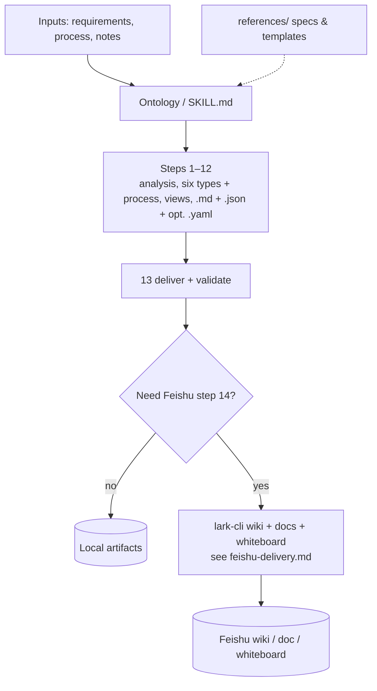
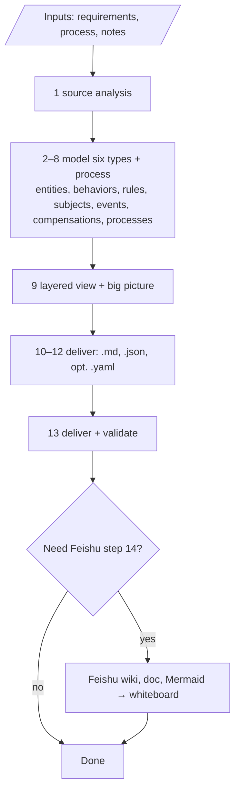
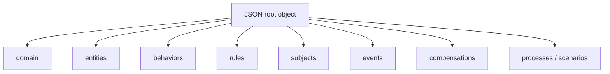

<div align="center">
  <h1>Ontology</h1>
  <p>
    From requirement documents, business processes, and technical specifications, it builds a unified six-part domain ontology (entities, behaviors, rules, scenarios/processes, subjects, domain events, exceptions and compensation, etc.), and outputs Markdown plus machine-consumable JSON, with optional YAML and Feishu wiki/whiteboard delivery; structured data can be validated with the bundled validation script.
  </p>
</div>

<p align="center">
  <a href="./README.en.md"></a>
  <a href="./README.md"></a>
</p>

<p align="center">
  <a href="./LICENSE"></a>
  
  <a href="https://github.com/larksuite/cli"></a>
  
  
  
  <a href="https://github.com/Lucky2024-pllove/Ontology"></a>
</p>

⬇️ [简体中文](./README.md) · `skill` · `ontology` · `domain-model` · `json` · `lark-cli` · `agent-agnostic`

---

<details open>
<summary><b>Table of contents</b></summary>

- [When to use (triggers)](#when-to-use-triggers)
- [What it solves](#what-it-solves)
- [Scope and validation (summary)](#scope-and-validation-summary)
- [Resource index](#resource-index)
- [Before / After](#before--after)
- [One-liner usage](#one-liner-usage)
- [Architecture](#architecture)
- [Install](#install)
- [How to use](#how-to-use)
- [Example prompts](#example-prompts)
- [Bundled example (contract management)](#bundled-example-contract-management)
- [Repository layout](#repository-layout)
- [Dependencies](#dependencies)
- [Agent compatibility](#agent-compatibility)
- [Disclaimer](#disclaimer)
- [Contributing & license](#contributing--license)

</details>

## When to use (triggers)

Aligned with [Section 1 (Triggers) in `SKILL.md`](./SKILL.md) (Chinese), typical cases:

- Extract a **domain ontology** from **requirements, business process, or technical notes**, and emit **machine-consumable ontology** (JSON first, optional YAML) for APIs / downstream systems
- You need a single vocabulary for the **six types**: entities, behaviors, rules, processes (scenarios), subjects, domain events, and compensations, including **event-driven** extensions (e.g. publish/subscribe on behaviors)
- You need **Markdown + JSON + (optional) YAML** for rules/flow/messaging bus integration
- **Optional:** archive the model under a **Feishu wiki** space/parent node and render **Mermaid** on **whiteboards**

If the agent cannot derive structure or completeness from scratch, follow the SOP and validation in `SKILL.md`.

## What it solves

Domain modeling needs a single vocabulary for **entities, behaviors, rules, processes (scenarios), subjects, domain events, and compensations**, plus **traceable documentation** and **downstream-consumable data** (root fields and terms: `SKILL.md` and [references/machine-readable-format.md](./references/machine-readable-format.md)). If your team uses Feishu, you also want the right **wiki space and parent node**, and Mermaid in docs rendered as **whiteboards**—but without a shared SOP, outputs drift, or you get un-auditable “I already saved it to Feishu” claims without a real CLI run.

**Ontology** encodes the workflow and root JSON fields in one [`SKILL.md`](./SKILL.md) (in Chinese). **By default** it only produces local `{basename}.md` / `{basename}.json` (and optional `.yaml`); **Feishu is not required.** Only when the user explicitly asks **and** provides parseable `space_id` / `parent_node_token` (etc.) should the agent run [`references/feishu-delivery.md`](./references/feishu-delivery.md) against **`lark-cli` for real** (step 14 in `SKILL.md`) and return links or errors.

## Scope and validation (summary)

See [Section 3 (Boundaries) in `SKILL.md`](./SKILL.md).

**Expected outputs**

- `{basename}.md`: overview, six-type sections, Mermaid, etc. (layout: [references/output-format.md](./references/output-format.md))
- `{basename}.json`: root must include `domain`, `entities`, `behaviors`, `rules`, `subjects`, `events`, `compensations`, `processes` (**arrays may be empty**, **keys must exist**; checked by `scripts/validate.py`)
- Optional `{basename}.yaml`: isomorphic to JSON

**Validation:** full checklist in `SKILL.md`; run `python scripts/validate.py path/to/domain.json` for top-level keys. The **single detailed** spec for JSON schema, references, and consumption is [references/machine-readable-format.md](./references/machine-readable-format.md).

**Stop / fallbacks:** unreadable or off-topic source → stop; partial delivery with “TBD” when input is thin; if only JSON or YAML is needed, **treat JSON as canonical**—see `SKILL.md` Section 3.

## Resource index

Same table as in [`SKILL.md`](./SKILL.md):

| Topic | File |
|------|------|
| Object analysis + EDA; subjects / events / compensations | [references/eda-subject-compensation.md](references/eda-subject-compensation.md) |
| Entity modeling | [references/ontology-methodology.md](references/ontology-methodology.md) |
| Behavior modeling | [references/behavior-modeling.md](references/behavior-modeling.md) |
| Rule modeling | [references/rule-modeling.md](references/rule-modeling.md) |
| Process / scenario | [references/process-modeling.md](references/process-modeling.md) |
| Human-readable layout & Mermaid | [references/output-format.md](references/output-format.md) |
| JSON structure, consumption, integration (single source of detail) | [references/machine-readable-format.md](references/machine-readable-format.md) |
| Document template | [assets/domain-model-template.md](assets/domain-model-template.md) |
| Feishu wiki + Mermaid / whiteboard | [references/feishu-delivery.md](references/feishu-delivery.md) |

## Before / After

| | Without a shared skill | This skill (Ontology) |
|---|:---:|:---:|
| **Vocabulary** | Inconsistent section names and fields | Six model types + `machine-readable-format` root keys aligned with [`SKILL.md`](./SKILL.md) |
| **Artifacts** | Ad-hoc Markdown / random JSON | Same basename `{basename}.md` + `{basename}.json` (+ optional `.yaml`) |
| **Validation** | Manual checklists | `python scripts/validate.py` for required top-level keys |
| **Feishu archive** | Verbal “done”, hard to audit | Step 14 + `lark-cli`; do not claim success if not executed |
| **Offline reading** | Constant web search | This repo’s [`references/`](./references/) hold methodology and format specs |

> **Local-only, no Feishu:** you do not need to install or run `lark-cli`. `references/` still helps the agent follow the full flow.

## One-liner usage

```
Use the Ontology skill: from the business description below, build the domain ontology and output .md and .json with the same basename as the domain name; self-check per SKILL.md (six model types and validation).
```

Add this only when you need Feishu (you must supply or allow parsing of space and parent node—no guessing):

```
Also archive {basename}.md to my Feishu wiki per feishu-delivery.md. space_id / parent_node_token: …
```

## Architecture



### SOP flow (summary)

Matches steps 1–14 in [`SKILL.md`](./SKILL.md); Feishu is the optional branch.



### Machine-readable JSON top level (keys checked by the script)

`scripts/validate.py` requires these **top-level keys**; arrays may be empty in business terms, but **keys must exist**. See [references/machine-readable-format.md](./references/machine-readable-format.md) for extensions.



> On **github.com**, Mermaid renders automatically; plain text or some local previews need Mermaid support.

## Install

### Prerequisites

- An agent that supports the [SKILL.md convention](https://docs.anthropic.com/en/docs/claude-code/skills) (see [Agent compatibility](#agent-compatibility))
- **Python 3** to run `scripts/validate.py`
- For Feishu: **[Node.js](https://nodejs.org/)** and a working [`@larksuite/cli`](https://www.npmjs.com/package/@larksuite/cli) (`lark-cli`), plus a configured Feishu app and auth (scopes per console and CLI). For complex whiteboards, see `npx @larksuite/whiteboard-cli` in [feishu-delivery.md](./references/feishu-delivery.md)

### How to add this skill

**Remote repository:** [https://github.com/Lucky2024-pllove/Ontology](https://github.com/Lucky2024-pllove/Ontology)

**Recommended:** add this directory to your agent’s **skills scan path**, or submodule / copy into a project.

```bash
git clone https://github.com/Lucky2024-pllove/Ontology.git
cd Ontology
```

Place the **directory that contains `SKILL.md`** (this package root) in the **current project** or the **global skills folder** (paths differ by product).

### First run (when writing to Feishu)

Typical CLI flow:

```bash
npm i -g @larksuite/cli
lark-cli config init --new
lark-cli auth login
```

Identity (`--as user` vs app), scopes, and subcommands: follow the [Feishu Open Platform](https://open.feishu.cn/) and `lark-cli wiki` / `lark-cli docs --help`. End-to-end steps: [feishu-delivery.md](./references/feishu-delivery.md).

## How to use

### 1. Local delivery (default)

Provide business and process text; require **same basename** `.md` and `.json` (**do not** run `lark-cli`). You can ask for:

```bash
python scripts/validate.py path/to/your-domain.json
```

### 2. Optional: YAML

When equivalent to JSON, emit `{basename}.yaml`; see step 12 in [`SKILL.md`](./SKILL.md).

### 3. Optional: Feishu wiki and whiteboard

**Only** when the user clearly wants an archive **and** has given `space_id`, `parent_node_token`, or equivalent locators, run [feishu-delivery.md](./references/feishu-delivery.md). **Do not** assume a successful archive without that information.

## Example prompts

| Goal | Example prompt |
|------|-----------------|
| Local files only | “Using the Ontology skill, build the domain model from the text below. Basename `order-service`. Only `.md` and `.json`—no Feishu.” |
| With validation | “After generation, run `scripts/validate.py` on the JSON and fix until it prints `OK`.” |
| Feishu archive | “Same as above; also write to Feishu wiki: space_id=…, parent_node_token=…, title=…—follow feishu-delivery strictly; on failure, print the error.” |
| Match the sample | “Align section layout and root keys with [examples/contract-management/](./examples/contract-management/), but for our supply-chain domain.” |

## Bundled example (contract management)

A full **contract management** sample illustrates the six types and output shape in [`SKILL.md`](./SKILL.md):

| File | Description |
|------|-------------|
| [contract-management.md](./examples/contract-management/contract-management.md) | Human-readable domain model (sections, Mermaid, etc.) |
| [contract-management.json](./examples/contract-management/contract-management.json) | Machine-readable JSON for the same domain |

From **this package root**:

```bash
python scripts/validate.py examples/contract-management/contract-management.json
```

Success prints `OK`; otherwise you get missing fields or parse errors.

## Repository layout

| Path | Description |
|------|-------------|
| [`README.md`](./README.md) / [`README.en.md`](./README.en.md) | Onboarding and install; **behavior and spec follow [`SKILL.md`](./SKILL.md)** |
| [`SKILL.md`](./SKILL.md) | Main skill: triggers, SOP 1–14, boundaries, index (Chinese—**source of truth**) |
| [`references/`](./references/) | Methodology, human-readable format, machine-readable format, optional [Feishu delivery](./references/feishu-delivery.md) (Chinese) |
| [`assets/domain-model-template.md`](./assets/domain-model-template.md) | Domain model document template |
| [`scripts/validate.py`](./scripts/validate.py) | Validate top-level keys in `*.json` |
| [`examples/contract-management/`](./examples/contract-management/) | Full example (`.md` / `.json`) |
| [`README.md`](./README.md) | Chinese (`简体中文`) version of this readme |
| [`LICENSE`](./LICENSE) | MIT |

## Dependencies

| Dependency | Role | Required? |
|------------|------|-----------|
| Agent with `SKILL.md` support | Load and run this skill | **Yes** (for chat / automation) |
| Python 3 | Run `scripts/validate.py` | **Recommended** (when validating JSON) |
| [`lark-cli`](https://github.com/larksuite/cli) | Feishu wiki, docs, whiteboard | Only for **optional Feishu step 14** |
| Feishu app and auth | Open Platform API | Only when using **Feishu** |

This repository **does not** contain app secrets or tenant data; `lark-cli` is an external tool.

## Agent compatibility

This skill is a plain `SKILL.md` pack—not tied to one vendor. Place the package in a **project directory** or **global skills path** (e.g. `~/.claude/skills/`, Cursor skills config—see your client’s docs).

## Disclaimer

Outputs are **modeling aids** (human-readable narrative and structured machine-readable data). They are **not** a guarantee of correct implementation, performance, or security. Production use is subject to your architects’ and teams’ own review.

## Contributing & license

- Released under [**MIT**](./LICENSE); keep the license notice when redistributing (documentation and example code are covered as stated in the license).
- Issues and PRs are welcome for doc fixes, and notes on compatibility with newer `lark-cli` or Mermaid/whiteboard flows.
