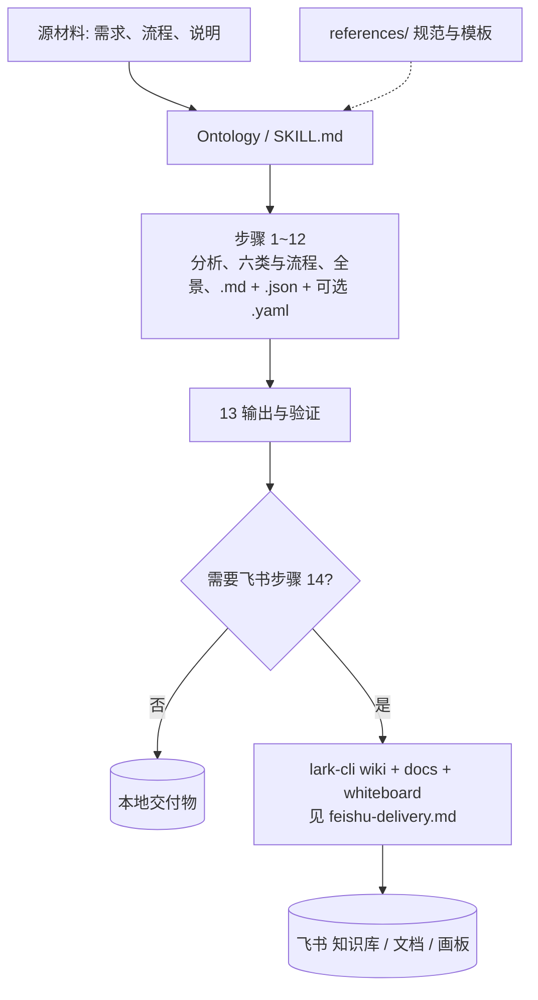
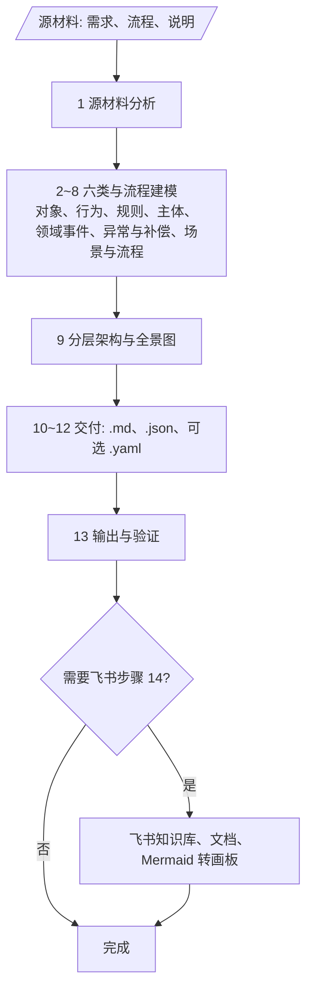
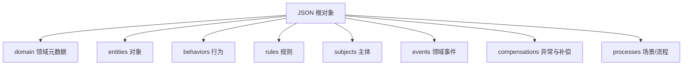

<div align="center">
  <h1>Ontology</h1>
  <p>
    <strong>把业务需求与流程，整理成文档 + 结构化数据</strong><br>
    根据你提供的需求、流程或说明，生成<strong>给人看的领域说明</strong>（<strong>Markdown</strong>）和<strong>给系统或接口用的数据</strong>（<strong>JSON</strong>，可选 <strong>YAML</strong>）。本技能<strong>支持飞书知识库</strong>：在配置好飞书应用与权限后，可用 <a href="https://www.npmjs.com/package/@larksuite/cli">lark-cli</a> 将内容写入<strong>飞书知识库</strong>，并将文档中的流程图同步到<strong>飞书画板</strong>。飞书侧的步骤、权限与约束见 <a href="./SKILL.md">SKILL.md</a>。
  </p>
</div>

<p align="center">
  <a href="./README.en.md"></a>
  <a href="./README.md"></a>
</p>

<p align="center">
  <a href="./LICENSE"></a>
  
  <a href="https://github.com/larksuite/cli"></a>
  
  
  
  <a href="https://github.com/Lucky2024-pllove/Ontology"></a>
</p>

⬇️ [English](./README.en.md) · `skill` · `ontology` · `domain-model` · `json` · `lark-cli` · `agent-agnostic`

---

<details open>
<summary><b>目录</b></summary>

- [它解决什么问题](#它解决什么问题)
- [Before / After](#before--after)
- [一句话怎么用](#一句话怎么用)
- [架构](#架构)
- [安装](#安装)
- [使用方式](#使用方式)
- [示例对话](#示例对话)
- [随仓库示例（合同管理）](#随仓库示例合同管理)
- [文件结构](#文件结构)
- [依赖](#依赖)
- [兼容 Agent](#兼容-agent)
- [免责声明](#免责声明)
- [贡献与许可证](#贡献与许可证)

</details>

## 它解决什么问题

做领域建模时，需要把**对象、行为、规则、流程（场景）、主体、领域事件、异常与补偿**放在同一套口径里，并产出**可追溯的人读文档**和**下游可消费的机器可读数据**。若团队用飞书沉淀，还希望**挂到指定知识空间与父节点**、把文档里的 Mermaid 落到**画板**——但缺少统一 SOP 时，易格式不一、或出现「说已归档却未走 CLI」的不可审计问题。

**Ontology** 用一份 [`SKILL.md`](./SKILL.md) 约定步骤与根字段；本地交付**不需要**飞书。仅在用户明确要求且**已提供**可解析的 `space_id` / `parent_node_token` 等时，才按 [`references/feishu-delivery.md`](./references/feishu-delivery.md) **真实执行** `lark-cli`，并回传链接或错误。

## Before / After

| | 无统一技能 | 本技能（Ontology） |
|---|:---:|:---:|
| **口径** | 各文档命名与章节不一致 | 六类模型 + `machine-readable-format` 根字段与 [`SKILL.md`](./SKILL.md) 术语表对齐 |
| **交付物** | 任意 Markdown / 散 JSON | 同基名 `{basename}.md` + `{basename}.json`（+ 可选 `.yaml`） |
| **校验** | 靠人工对表 | `python scripts/validate.py` 检查 JSON 顶层必填键 |
| **飞书归档** | 口授「已传」、难审计 | 按步骤 14 与 `lark-cli`，未执行则不声称完成 |
| **脱机查阅** | 常需现搜规范 | 本仓库 [`references/`](./references/) 内嵌方法论与格式说明 |

> **仅本地、不要飞书**时不必安装或执行 `lark-cli`；`references/` 仍可用于让 Agent 理解完整流程。

## 一句话怎么用

```
请按 Ontology 技能，根据下面业务说明生成本体：输出与领域名同基名的 .md 和 .json，并按 SKILL.md 六类与校验要求自检。
```

需要飞书时再补一句（**须给出或可解析**空间与父节点，不可臆造）：

```
同时把 {basename}.md 按 feishu-delivery.md 归档到我的飞书知识库，space_id / parent_node_token 如下：……
```

## 架构



### 技能作业流（SOP 摘要）

与 [`SKILL.md`](./SKILL.md) 步骤 1～14 一致；飞书为可选分支。



### 机器可读 JSON 顶层（校验必填键）

`scripts/validate.py` 要求根对象**包含**下列键；各数组在业务上可为空，但**键名须存在**。扩展约定见 [references/machine-readable-format.md](./references/machine-readable-format.md)。



> 在 **github.com** 打开本页时，上述 Mermaid 会自动渲染；纯文本或部分本地预览需支持 Mermaid。

## 安装

### 前置条件

- 支持 [SKILL.md 规范](https://docs.anthropic.com/en/docs/claude-code/skills) 的 Agent（见 [兼容 Agent](#兼容-agent)）
- 校验 JSON：本机已安装 **Python 3**
- 若需飞书归档：**[Node.js](https://nodejs.org/)** + 可用的 **[`@larksuite/cli`](https://www.npmjs.com/package/@larksuite/cli)**（`lark-cli`），以及已配置的飞书应用与授权（scope 以控制台与 CLI 提示为准）。复杂画板可配合 `npx @larksuite/whiteboard-cli`（见 [feishu-delivery.md](./references/feishu-delivery.md)）

### 安装方式

**远程仓库**：[https://github.com/Lucky2024-pllove/Ontology](https://github.com/Lucky2024-pllove/Ontology)

**推荐：将本目录加入 Agent 的 skills 扫描路径**，或把本仓库作为子模块 / 拷贝进项目使用。

```bash
git clone https://github.com/Lucky2024-pllove/Ontology.git
cd Ontology
```

将 **包含 `SKILL.md` 的目录**（本包根目录）放在**当前项目**或 **Agent 全局 skills 目录**（各工具路径不同，以所用客户端为准）。

### 首次使用飞书写入时

与官方 CLI 一致，例如：

```bash
npm i -g @larksuite/cli
lark-cli config init --new
lark-cli auth login
```

用户身份、scope 等以你租户与 [飞书开放平台](https://open.feishu.cn/) 文档为准；知识库与文档子命令以 `lark-cli wiki`、`lark-cli docs` 的 `--help` 为准，详细编排见 [feishu-delivery.md](./references/feishu-delivery.md)。

## 使用方式

### 1. 仅本地交付（默认）

提供业务说明、流程或技术材料，要求输出 **同基名** 的 `.md` 与 `.json`（**不执行** `lark-cli`）。可要求运行：

```bash
python scripts/validate.py path/to/你的领域.json
```

### 2. 可选：YAML

与 JSON 语义等价时生成 `{basename}.yaml`，见 [`SKILL.md`](./SKILL.md) 步骤 12。

### 3. 可选：飞书知识库与画板

**仅当**用户明确需要归档，且**已提供** `space_id`、`parent_node_token` 等可定位信息时，由 Agent 按 [feishu-delivery.md](./references/feishu-delivery.md) 执行；**不可**在缺少信息时假设已归档。

## 示例对话

| 目标 | 示例提示 |
|------|----------|
| 只产出本地文件 | 「按 Ontology 技能，根据下文整理领域本体，基名用 `order-service`，只给我 `.md` 和 `.json`，不要动飞书。」 |
| 带自检 | 「生成后请用本包 `scripts/validate.py` 校验 JSON 并修到 `OK`。」 |
| 飞书归档 | 「同上；另外写入飞书知识库：space_id=…，parent_node_token=…，标题…，请严格走 feishu-delivery，执行失败则说明错误。」 |
| 对照示例 | 「输出结构请对齐 [examples/contract-management/](./examples/contract-management/) 的章节与根字段，领域换成我们供应链场景。」 |

## 随仓库示例（合同管理）

本包自带 **「合同管理系统」** 样例，便于对照 [SKILL.md](./SKILL.md) 的六类与输出形态：

| 文件 | 说明 |
|------|------|
| [contract-management.md](./examples/contract-management/contract-management.md) | 人读领域模型文档（章节与 Mermaid 等） |
| [contract-management.json](./examples/contract-management/contract-management.json) | 同域机器可读 JSON |

在**本包根目录**执行：

```bash
python scripts/validate.py examples/contract-management/contract-management.json
```

成功时终端输出 `OK`；否则打印缺字段或 JSON 解析错误。

## 文件结构

| 路径 | 说明 |
|------|------|
| [`SKILL.md`](./SKILL.md) | 主技能：触发条件、SOP 1～14、能力边界、资源索引 |
| [`references/`](./references/) | 方法论、人读版式、机器可读格式、**可选** [飞书交付](./references/feishu-delivery.md) |
| [`assets/domain-model-template.md`](./assets/domain-model-template.md) | 领域模型文档模板 |
| [`scripts/validate.py`](./scripts/validate.py) | 校验 `*.json` 顶层与必填字段 |
| [`examples/contract-management/`](./examples/contract-management/) | 合同管理完整示例（`.md` / `.json`） |
| [`README.en.md`](./README.en.md) | 本说明的英文版 |
| [`LICENSE`](./LICENSE) | MIT |

## 依赖

| 依赖 | 用途 | 必需？ |
|------|------|--------|
| 支持 `SKILL.md` 的 Agent | 解析并执行本技能 | **是**（对话/自动化场景） |
| Python 3 | 运行 `scripts/validate.py` | **推荐**（本地校验 JSON 时） |
| [`lark-cli`](https://github.com/larksuite/cli) | 飞书知识库、云文档、画板相关命令 | 仅**需要飞书步骤 14** 时 |
| 飞书应用与授权 | 调开放平台、用户或应用身份 | 仅**需要飞书**时 |

本仓库**不包含**应用密钥或租户数据；`lark-cli` 为外部工具，以官方发行版为准。

## 兼容 Agent

本技能为开放 `SKILL.md` 形式，不绑定单一平台。将本包置于**项目目录**或**全局 skills 目录**（如 Claude Code 的 `~/.claude/skills/`、Cursor 配置的 skills 路径等，以各产品文档为准）。

## 免责声明

本 Skill 输出为**领域建模辅助材料**（人读说明与结构化的机器可读数据），**不构成**对具体系统实现、性能或安全性的保证；是否投入生产与如何落地，需由架构与开发团队结合约束**自行**评审。

## 贡献与许可证

- 以 [**MIT**](./LICENSE) 发布；保留许可证声明即可在内部或商业场景使用（技能文档与示例代码以许可证为准）。
- 欢迎通过 Issue / PR 修正文档、补充与新版 `lark-cli` 或 Mermaid/画板流程的兼容说明。
