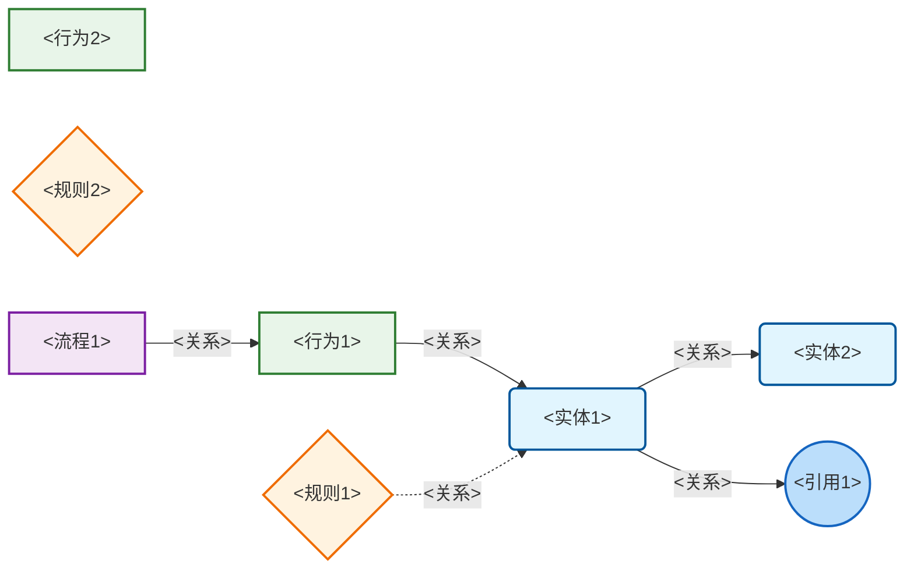
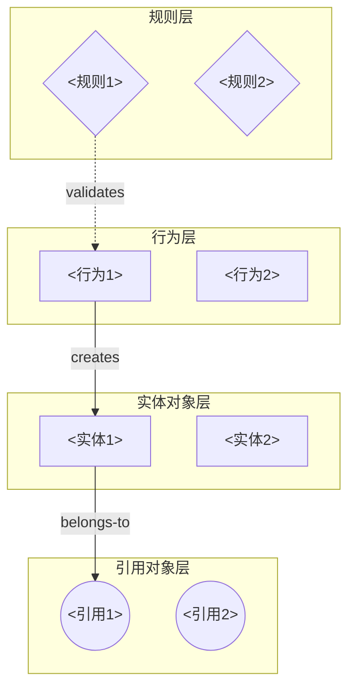
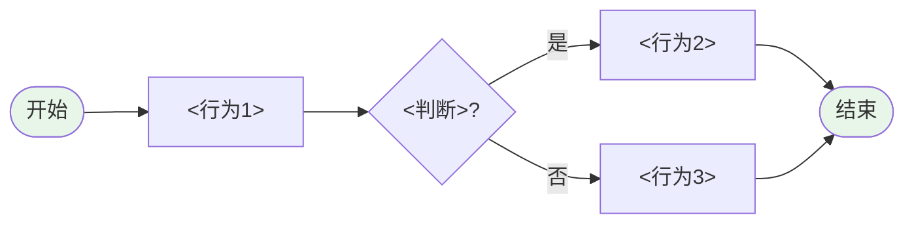
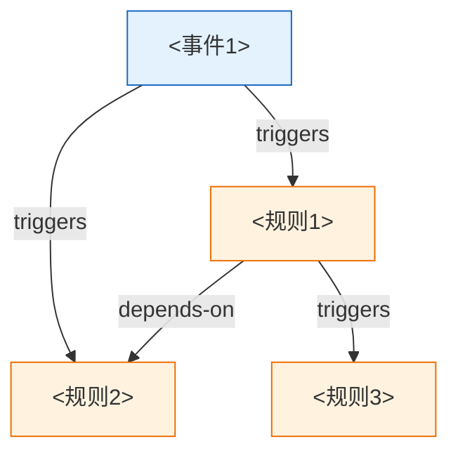
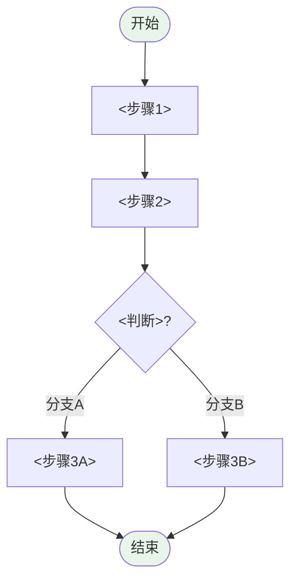
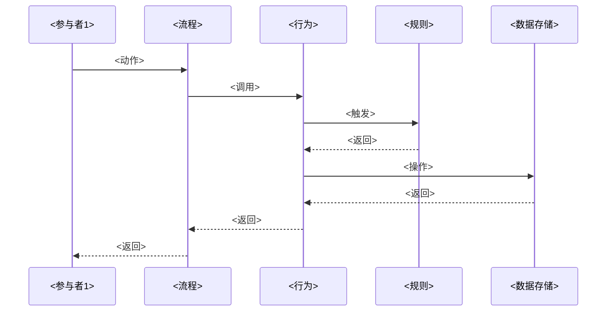

# <领域名称> 领域模型

## 1. 领域概览

### 1.1 领域描述
<在此处简要描述领域的业务范围、背景和目标>

### 1.2 模型总览（对象 / 行为 / 规则 / 场景 / 主体 / 领域事件 / 异常与补偿）

| 层级 | 核心内容 | 要素数量 |
|-----|---------|---------|
| 对象模型 | 数据实体及其关系 | <N>个实体 |
| 行为模型 | 对象操作与事件发布/消费 | <N>个行为 |
| 规则模型 | 业务规则与约束 | <N>条规则 |
| 主体模型 | 人、组织、系统角色、外部系统 | <N>个主体 |
| 领域事件 | 行为→事件→行为/规则 链 | <N>个事件 |
| 异常与补偿 | 长流程失败与 Saga/冲正 | <N>项补偿 |
| 场景/流程 | 用例、编排、步骤与分支 | <N>个流程或场景 |

### 1.3 核心实体列表

| 实体名称 | 类型 | 定义 |
|---------|------|------|
| <实体1> | 核心/引用 | <定义描述> |
| <实体2> | 核心/引用 | <定义描述> |

### 1.4 核心用例列表

| 用例名称 | 参与者 | 描述 |
|---------|--------|------|
| <用例1> | <参与者> | <描述> |
| <用例2> | <参与者> | <描述> |

## 2. 对象模型

### 2.1 实体定义

#### 2.1.1 <实体名称>

**实体类型**：核心实体 / 引用实体

**父类**：<直接父类（如有，根为"Thing"）>

**定义**：<实体的详细定义和说明>

**属性列表**：

| 属性名称 | 数据类型 | 约束 | 描述 |
|---------|---------|------|------|
| <属性1> | <类型> | <约束条件> | <描述> |
| <属性2> | <类型> | <约束条件> | <描述> |

**关联关系**：
- <关系名称> → <关联实体>（<基数>）
- <关系名称> → <关联实体>（<基数>）

**实例**：

| 实例名称 | <属性1> | <属性2> |
|---------|---------|---------|
| <实例1> | <值> | <值> |
| <实例2> | <值> | <值> |

### 2.2 实体关系矩阵

| 实体A | 关系 | 实体B | 基数 | 描述 |
|------|------|------|------|------|
| <实体1> | <关系> | <实体2> | <1:N/N:1/N:M> | <描述> |

## 3. 行为模型

### 3.1 行为定义

#### 3.1.1 <行为名称>

**所属实体**：<该行为所属的数据实体>

**定义**：<行为的业务描述和执行逻辑>

**输入参数**：

| 参数名称 | 数据类型 | 约束 | 描述 |
|---------|---------|------|------|
| <参数1> | <类型> | <约束条件> | <描述> |
| <参数2> | <类型> | <约束条件> | <描述> |

**输出结果**：

| 结果类型 | 数据类型 | 描述 |
|---------|---------|------|
| 成功 | <类型> | <成功时的返回结果> |
| 失败 | <异常类型> | <失败时的异常信息> |

**前置条件**：
- <条件1：执行前必须满足的条件>
- <条件2：执行前必须满足的条件>

**后置条件**：
- <条件1：执行后保证的状态>
- <条件2：执行后保证的状态>

**调用关系**：
- invokes → <被调用的行为列表>
- triggered-by → <触发该行为的行为/事件>

**关联规则**：
- validates → <该行为触发校验的规则>
- follows → <该行为执行前必须通过的规则>

### 3.2 行为关联矩阵

| 行为 | 调用行为 | 触发规则 | 发布事件 | 消费事件 | 所属流程/场景 |
|------|---------|---------|---------|---------|---------|
| <行为1> | <行为2, 行为3> | <规则1> | <Event-...> | <Event-...> | <Process-...> |

## 4. 规则模型

### 4.1 规则定义

#### 4.1.1 <规则名称>

**规则ID**：<唯一标识，如RULE-001>

**类型**：校验规则 / 业务规则 / 状态规则 / 计算规则

**描述**：<规则的详细业务描述>

**触发条件**：
- 事件：<触发事件，如"订单提交时">
- 对象：<作用对象，如"订单对象">
- 时机：<触发时机，如"提交前校验">

**规则条件**：
- 条件表达式：<布尔表达式，如"订单金额 > 0">
- 条件说明：<自然语言说明>

**规则动作**：

条件为真时：
- <动作1：如"继续后续流程">
- <动作2：如"记录日志">

条件为假时：
- <动作1：如"抛出异常">
- <动作2：如"返回错误信息">

**优先级**：<数值，如100>

**生效范围**：<全局/特定对象/特定场景>

### 4.2 规则依赖矩阵

| 规则 | 触发事件 | 依赖规则 | 优先级 |
|------|---------|---------|--------|
| <规则1> | <事件A> | <规则2> | <100> |

## 5. 主体模型

### 5.1 主体定义

#### 5.1.1 <主体名称>

**主体ID**：<Subject-xxx>

**类型**：角色 / 人员 / 组织 / 系统 / 外部

**描述**：<职责与能力边界>

**常执行或负责的行为**：<Behavior-...>（可空）

**参与的流程/场景**：<Process-...>（可空）

**与数据实体关联**（可选）：<boundEntityId 或 引用实体名>

## 6. 领域事件与事件链（EDA）

### 6.1 领域事件

#### 6.1.1 <事件名称>

**事件ID**：<Event-xxx>

**由何行为产生**：<Behavior-...> 或 外部系统

**被哪些行为/规则消费**：行为 <...>，规则 <...>

**载荷摘要**：<键说明或投影说明>

### 6.2 行为→事件→行为 链

| 步骤 | 行为 | 产生事件 | 后续行为/规则 |
|------|------|---------|--------------|
| 1 | <行为A> | <Event-001> | <行为B> / <规则R> |
| 2 | ... | ... | ... |

## 7. 异常与补偿

### 7.1 补偿项

#### 7.1.1 <补偿名称>

**ID**：<Compensation-xxx>

**触发条件**（失败/回滚类）：<自然语言或步骤引用>

**关联流程/场景**：<Process-...>

**自何步骤失败可触发**：<Step-...>（可空）

**补偿行为及顺序**：<逆序/顺序/并行>，行为列表 <Behavior-...>

## 8. 流程/场景模型

### 8.1 用例定义

#### 5.1.1 <用例名称>

**用例ID**：<唯一标识，如UC-001>

**参与者**：<主要参与者>, <次要参与者>

**前置条件**：
- <条件1：执行用例前必须满足的条件>

**后置条件**：
- <条件1：用例执行后的系统状态>

**基本流程**：
1. [<参与者>] [<动作>]
2. [系统] [<响应/处理>]
3. [<参与者>] [<动作>]
4. ...

**扩展流程**：
```
<步骤号>a. [分支条件]:
    <步骤号>a.1 [处理步骤]
    <步骤号>a.2 [处理步骤]
```

**异常流程**：
```
<步骤号>a. [异常条件]:
    <步骤号>a.1 [异常处理]
    <步骤号>a.2 [异常处理]
```

**业务规则**：
- <规则ID或规则描述>

**数据需求**：
- 输入：<输入数据描述>
- 输出：<输出数据描述>

### 8.2 业务流程 / 业务场景

#### 8.2.1 <流程或场景名称>

**流程ID**：<唯一标识，如PROC-001>

**触发条件**：<触发条件描述>

**参与者**：<参与者列表>

**流程步骤**：

| 步骤 | 活动 | 类型 | 调用行为 | 触发规则 | 参与者 |
|-----|------|------|---------|---------|--------|
| 1 | <活动1> | <用户任务/自动任务> | <行为1> | <规则1> | <参与者> |
| 2 | <活动2> | <用户任务/自动任务> | <行为2> | - | <参与者> |

**分支逻辑**：
- <条件A> → <步骤X>
- <条件B> → <步骤Y>

**异常处理**：
- <异常类型> → <处理步骤>（与「异常与补偿」章可对表）

## 9. 可视化图

### 9.1 全景知识图谱



### 9.2 分层架构图



### 9.3 对象模型图

```mermaid
classDiagram
    class Thing {
        <<根概念>>
    }
    
    class <实体1> {
        +<类型> <属性1>
        +<类型> <属性2>
        +<方法1>()
        +<方法2>()
    }
    
    class <实体2> {
        +<类型> <属性1>
        +<类型> <属性2>
    }
    
    Thing <|-- <实体1>
    Thing <|-- <实体2>
    
    <实体1> "1" --> "N" <实体2> : <关系>
```

### 9.4 行为调用图



### 9.5 规则依赖图



### 9.6 业务流程图



### 9.7 时序图



## 10. 附录

### 10.1 术语表

| 术语 | 解释 |
|-----|------|
| <术语1> | <解释> |
| <术语2> | <解释> |

### 10.2 变更记录

| 版本 | 日期 | 变更内容 | 作者 |
|-----|------|---------|------|
| 1.0 | <日期> | <初始版本> | <作者> |

## 8. 机器可读格式（JSON）

### 8.1 JSON 文件说明

本领域模型同时提供机器可读的 JSON 格式文件（**与本文档同基名**，扩展名为 `.json`），与本文档（Markdown）内容一致，但以结构化数据形式组织，便于程序解析和自动化处理。

### 8.2 JSON 结构概览

```json
{
  "domain": {
    "name": "<领域名称>",
    "nameEn": "<DomainName>",
    "description": "<领域描述>",
    "version": "1.0"
  },
  "metadata": {
    "generatedAt": "2024-01-15T10:30:00Z",
    "source": "<源材料>",
    "author": "Domain Modeler"
  },
  "statistics": {
    "entityCount": <N>,
    "behaviorCount": <N>,
    "ruleCount": <N>,
    "processCount": <N>
  },
  "entities": [...],
  "behaviors": [...],
  "rules": [...],
  "processes": [...]
}
```

### 8.3 对象模型 JSON 示例

```json
{
  "entities": [
    {
      "id": "Entity-001",
      "name": "<实体名称>",
      "nameEn": "<EntityName>",
      "type": "core",
      "parentId": null,
      "description": "<实体描述>",
      "properties": [
        {
          "name": "<属性1>",
          "dataType": "<String/Integer/Decimal/...>",
          "constraints": {
            "required": <true/false>,
            "unique": <true/false>,
            "min": <数值>,
            "max": <数值>,
            "pattern": "<正则表达式>",
            "enum": [<"值1">, <"值2">]
          },
          "description": "<属性描述>"
        }
      ],
      "relations": [
        {
          "targetId": "<Entity-002>",
          "type": "<1:1/1:N/N:1/N:M>",
          "relationType": "<inheritance/association/composition/aggregation>",
          "description": "<关系描述>"
        }
      ],
      "metadata": {}
    }
  ]
}
```

### 8.4 行为模型 JSON 示例

```json
{
  "behaviors": [
    {
      "id": "Behavior-001",
      "name": "<行为名称>",
      "entityId": "<Entity-001>",
      "description": "<行为描述>",
      "signature": {
        "inputs": [
          {
            "name": "<参数1>",
            "dataType": "<类型>",
            "required": <true/false>,
            "constraints": {},
            "description": "<参数描述>"
          }
        ],
        "outputs": [
          {
            "name": "<结果名称>",
            "dataType": "<类型>",
            "description": "<结果描述>"
          }
        ],
        "exceptions": [
          {
            "type": "<异常类型>",
            "condition": "<触发条件>",
            "message": "<异常信息>"
          }
        ]
      },
      "preconditions": ["<条件1>", "<条件2>"],
      "postconditions": ["<条件1>", "<条件2>"],
      "invokes": ["<Behavior-002>", "<Behavior-003>"],
      "triggeredBy": ["<Process-001>"],
      "validates": ["<Rule-001>"],
      "metadata": {}
    }
  ]
}
```

### 8.5 规则模型 JSON 示例

```json
{
  "rules": [
    {
      "id": "Rule-001",
      "name": "<规则名称>",
      "type": "<validation/business/state/computation>",
      "description": "<规则描述>",
      "trigger": {
        "event": "<触发事件>",
        "target": "<作用对象>",
        "timing": "<触发时机>"
      },
      "condition": {
        "expression": "<条件表达式>",
        "description": "<条件说明>"
      },
      "actions": {
        "onTrue": ["<动作1>", "<动作2>"],
        "onFalse": ["<动作1>", "<动作2>"]
      },
      "priority": <100>,
      "scope": "<生效范围>",
      "dependsOn": ["<Rule-002>"],
      "triggers": ["<Rule-003>"],
      "metadata": {}
    }
  ]
}
```

### 8.6 流程模型 JSON 示例

```json
{
  "processes": [
    {
      "id": "Process-001",
      "name": "<流程名称>",
      "type": "<business/system>",
      "description": "<流程描述>",
      "trigger": "<触发条件>",
      "participants": ["<参与者1>", "<参与者2>"],
      "steps": [
        {
          "id": "Step-001",
          "name": "<步骤名称>",
          "type": "<userTask/serviceTask/scriptTask/decision/subProcess>",
          "behaviorId": "<Behavior-001>",
          "rules": ["<Rule-001>"],
          "participant": "<参与者>",
          "transitions": [
            {
              "to": "<Step-002/End>",
              "condition": "<条件>",
              "type": "<success/failure/conditional>"
            }
          ]
        }
      ],
      "metadata": {}
    }
  ]
}
```

### 8.7 ID 映射表

| Markdown名称 | JSON ID | 类型 |
|-------------|---------|------|
| <实体1> | Entity-001 | 实体 |
| <实体2> | Entity-002 | 实体 |
| <行为1> | Behavior-001 | 行为 |
| <规则1> | Rule-001 | 规则 |
| <流程1> | Process-001 | 流程 |

### 8.8 机器消费示例

```javascript
// 加载领域模型
const domainModel = require('./<basename>.json'); // 与本文档同基名

// 查询实体
const entity = domainModel.entities.find(e => e.id === 'Entity-001');

// 获取实体的所有属性
const properties = entity.properties;

// 获取实体的关联实体
const relatedEntities = entity.relations.map(r => ({
  relation: r,
  target: domainModel.entities.find(e => e.id === r.targetId)
}));

// 按优先级排序规则
const sortedRules = domainModel.rules.sort((a, b) => b.priority - a.priority);

// 模拟流程执行
const process = domainModel.processes.find(p => p.id === 'Process-001');
console.log(`流程"${process.name}"包含${process.steps.length}个步骤`);
```

### 8.9 详细规范

`entities` 等根字段的完整定义与消费约定见：
[references/machine-readable-format.md](../references/machine-readable-format.md)

