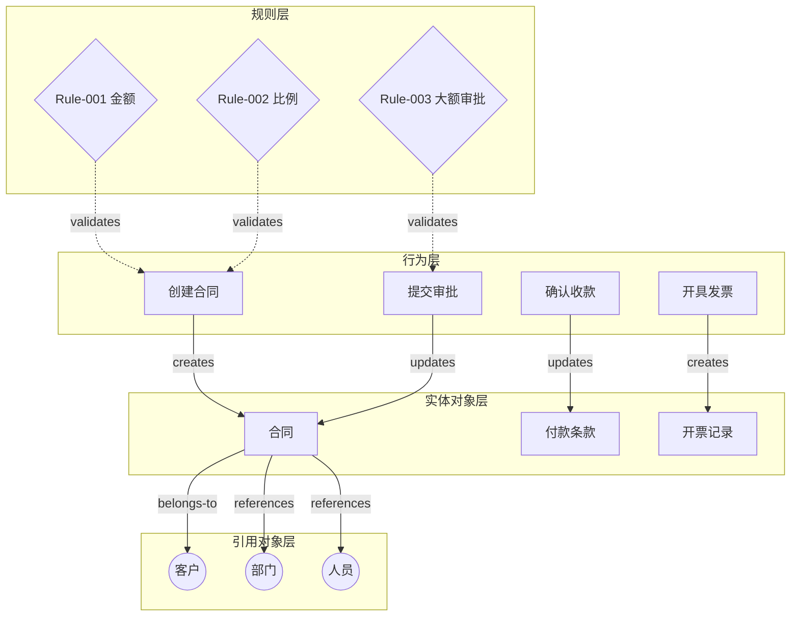
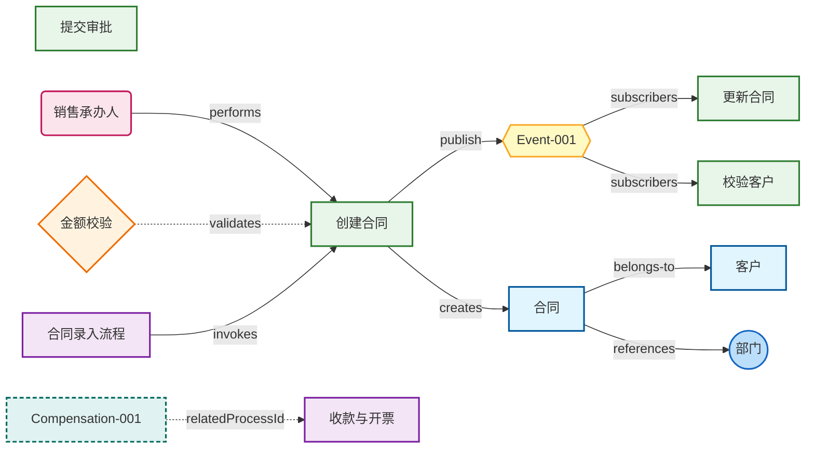
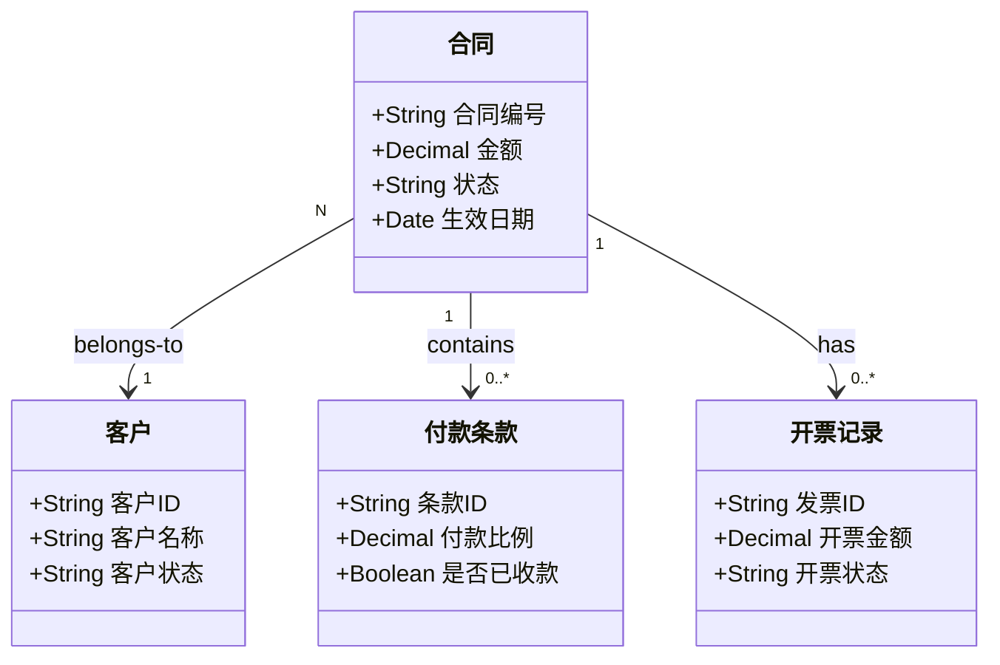
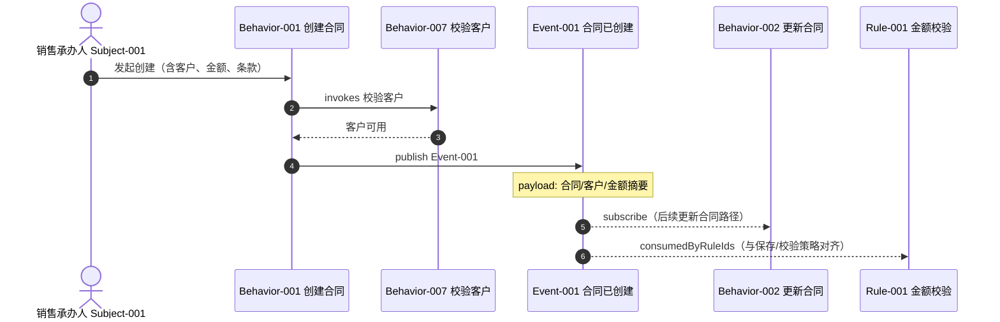
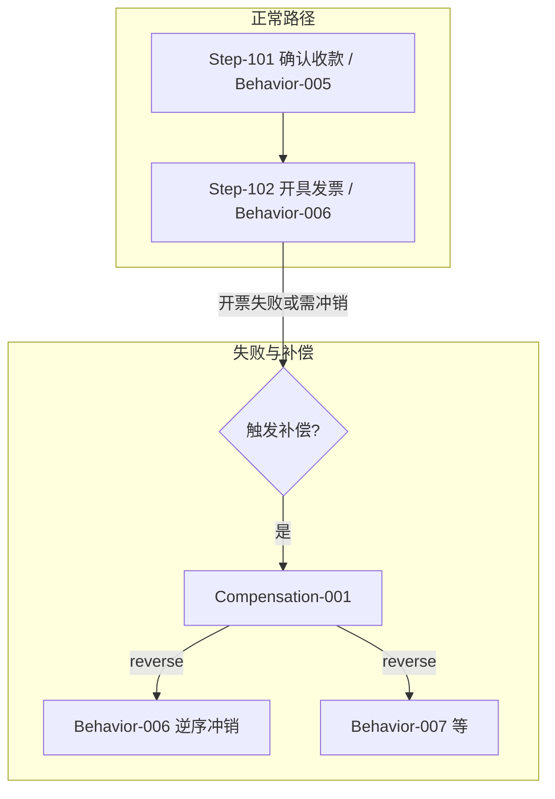
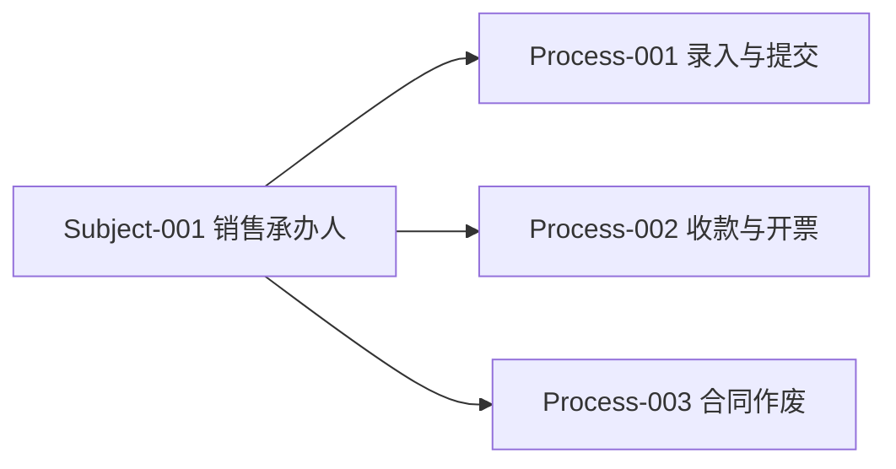

# 合同管理系统 领域模型

## 1. 领域概览

### 1.1 领域描述

合同管理系统覆盖业务合同从创建、审批、生效到收款、开票及作废的全生命周期，支撑销售承办、财务收款与主数据（客户、部门、人员）引用。

### 1.2 六类要素总览

主体、领域事件、异常与补偿在正文 **5～7** 独立展开，并在 **9** 用图/表与 JSON 对齐。

| 层级 | 核心内容 | 要素数量 |
|-----|---------|---------|
| 对象模型 | 数据实体及其关系 | 6 个实体 |
| 行为模型 | 对象操作与事件发布/消费 | 8 个行为 |
| 规则模型 | 业务规则与约束 | 6 条规则 |
| 主体模型 | 角色/系统/组织等 | 1 个主体 |
| 领域事件 | 行为 → 事件 → 行为/规则 | 1 个事件 |
| 异常与补偿 | 长流程失败与冲正/逆序 | 1 项补偿 |
| 场景/流程 | 业务编排与步骤（`processes`） | 3 个流程 |

### 1.3 核心实体列表

| 实体名称 | 类型 | 定义 |
|---------|------|------|
| 合同 | 核心 | 业务合同主数据，含金额、状态、客户与条款 |
| 客户 | 核心 | 签约客户 |
| 付款条款 | 核心 | 分期比例与收款状态 |
| 开票记录 | 核心 | 发票开具与状态 |
| 部门 | 引用 | 组织主数据 |
| 人员 | 引用 | 员工主数据 |

### 1.4 核心用例列表

| 用例名称 | 主要参与者 | 描述 |
|---------|-----------|------|
| 合同录入与提交 | 销售承办人（`Subject-001`）、合同系统 | 从填写信息、创建草稿、修改到提交审批（`Process-001`） |
| 收款与开票 | 财务、合同系统 | 已生效合同下的分期确认收款与开具发票；失败路径见补偿（`Process-002` 与 `Compensation-001`） |
| 合同作废 | 销售承办人、合同系统 | 业务作废前校验发票与状态（`Process-003`） |

---

## 2. 对象模型

### 2.1 实体定义（摘要）

#### 合同（Entity-001）

**实体类型**：核心实体  

**定义**：记录合同编号、金额、状态、生效日期，关联客户、付款条款、开票、部门与承办人。

**属性列表**：

| 属性名称 | 数据类型 | 约束 | 描述 |
|---------|---------|------|------|
| 合同编号 | String | 必填、唯一、^CT[0-9]{10}$ | 合同唯一编号 |
| 金额 | Decimal | 必填、>=0 | 合同总金额（含税） |
| 状态 | String | 枚举 | 草稿/待审批/已生效/已作废/已完结 |
| 生效日期 | Date | 可选 | 生效日 |

**关联关系**：

- belongs-to → 客户（N:1）
- contains → 付款条款（1:N）
- has → 开票记录（1:N）
- managed-by → 部门、人员（N:1）

### 2.2 实体关系矩阵

| 实体A | 关系 | 实体B | 基数 | 描述 |
|------|------|------|------|------|
| 合同 | belongs-to | 客户 | N:1 | 签约客户 |
| 合同 | contains | 付款条款 | 1:N | 分期条款 |
| 合同 | has | 开票记录 | 1:N | 开票 |
| 人员 | belongs-to | 部门 | N:1 | 组织归属 |

---

## 3. 行为模型

### 3.1 行为定义（摘要）

| 行为 ID | 名称 | 所属实体 | 说明 |
|---------|------|---------|------|
| Behavior-001 | 创建合同 | 合同 | 新建草稿、生成编号；发布 `Event-001` |
| Behavior-002 | 更新合同 | 合同 | 草稿/待审批下修改；订阅 `Event-001` |
| Behavior-003 | 作废合同 | 合同 | 作废及原因 |
| Behavior-004 | 提交审批 | 合同 | 进入审批流 |
| Behavior-005 | 确认收款 | 付款条款 | 标记某期已收款 |
| Behavior-006 | 开具发票 | 开票记录 | 创建发票记录 |
| Behavior-007 | 校验客户 | 客户 | 创建合同时校验客户；订阅 `Event-001` |
| Behavior-008 | 审批通过回调 | 合同 | 外部审批结果回写 |

### 3.2 行为关联矩阵

| 行为 | 调用行为 | 触发规则 | 所属流程 |
|------|---------|---------|---------|
| 创建合同 | 校验客户 | Rule-001, Rule-002 | 合同录入与提交 |
| 提交审批 | - | Rule-001~003 | 合同录入与提交 |

---

## 4. 规则模型

### 4.1 规则定义（摘要）

| 规则 ID | 名称 | 类型 | 优先级 |
|---------|------|------|--------|
| Rule-001 | 合同金额非空且大于零 | 校验 | 900 |
| Rule-002 | 付款条款比例之和为100% | 校验 | 850 |
| Rule-003 | 大额合同必须审批 | 业务 | 700 |
| Rule-004 | 合同状态转换合法 | 状态 | 800 |
| Rule-005 | 累计开票不超过合同金额 | 校验 | 750 |
| Rule-006 | 作废前检查未结清发票 | 业务 | 720 |

### 4.2 规则依赖

- Rule-003 依赖 Rule-001、Rule-002（提交审批前金额与条款已合法）

---

## 5. 主体模型

### 5.1 主体定义

#### 销售承办人（Subject-001）

| 字段 | 值 |
|------|-----|
| **主体 ID** | `Subject-001` |
| **类型** | 角色（`role`） |
| **描述** | 负责合同创建、维护与业务侧作废申请；与「合同」实体的业务责任人对应（`boundEntityId` 本示例中为空，承办人由合同关联 `Entity-006` 人员表达）。 |
| **常执行/负责的行为** | `Behavior-001` 创建合同、`Behavior-002` 更新合同、`Behavior-003` 作废合同 |
| **参与的流程/场景** | `Process-001` 合同录入与提交、`Process-002` 收款与开票（协同）、`Process-003` 合同作废 |
| **与 JSON 对齐** | `performsBehaviorIds`、`participatesInProcessIds` 与上表一致 |

### 5.2 主体参与简表

| 主体 | 流程 | 在流程中的位置（摘要） |
|------|------|------------------------|
| Subject-001 | Process-001 | 用户任务步（填写、修改）；服务步由系统执行但业务责任在销售侧发起 |
| Subject-001 | Process-002 | 与「财务人员」同栏参与者中的业务协同（JSON `participants` 与步骤 `participant` 可对读） |
| Subject-001 | Process-003 | 作废申请用户任务、作废执行 |

---

## 6. 领域事件与事件链（EDA）

### 6.1 领域事件：合同已创建（Event-001）

| 字段 | 值 |
|------|-----|
| **事件 ID** | `Event-001` |
| **名称** | 合同已创建 |
| **由何行为产生** | `Behavior-001`（`publishedByBehaviorId`） |
| **被哪些行为消费** | `Behavior-002` 更新合同、`Behavior-007` 校验客户（`consumedByBehaviorIds`） |
| **被哪些规则消费** | `Rule-001`（`consumedByRuleIds`，与「保存/更新前校验」语义对齐） |
| **载荷摘要** | `payload.summary`：合同 ID、客户 ID、金额等（见 JSON） |
| **关联实体** | `Entity-001` 合同（`relatedEntityIds`） |

### 6.2 行为 → 事件 → 行为/规则 链

| 步骤 | 行为 | 产生事件 | 后续行为/规则 |
|------|------|---------|--------------|
| 1 | `Behavior-001` 创建合同 | `Event-001` | `Behavior-002`、`Behavior-007` 订阅；`Rule-001` 可视为与持久化/保存语义绑定 |

### 6.3 事件链（Mermaid 摘要）

> 与 **第 9.5 节** 时序图一致，此处为文字锚点。

`Behavior-001` **publish** → `Event-001` → `Behavior-002` / `Behavior-007` **subscribe**；规则侧与 `Rule-001` 的衔接见 JSON 中 `consumedByRuleIds`。

---

## 7. 异常与补偿

### 7.1 补偿项：收款子流程中开票失败时的回退（Compensation-001）

| 字段 | 值 |
|------|-----|
| **ID** | `Compensation-001` |
| **名称** | 收款子流程中开票失败时的回退 |
| **触发条件** | `Process-002` 中开票或应收步骤失败，或需人工冲销时（`trigger` 字段） |
| **关联流程** | `Process-002`（`relatedProcessId`） |
| **自何步骤** | `Step-102` 开具发票（`fromStepId`） |
| **补偿行为及顺序** | 逆序（`executionOrder`: `reverse`）：`Behavior-007`（校验/冲销相关语义以业务解释为准）、`Behavior-006` 开具发票 的逆操作列表见 `compensatingBehaviorIds`（JSON） |

本示例中补偿与 **多步长流程** 的对应关系在「第 8.2 节 收款与开票」与 **第 9.6 节** 补偿路径图中可对读。

### 7.2 与业务/技术「异常」区分

- **业务补偿**（本层）：`compensations` 描述 Saga/冲正、与 `Process` 步骤绑定。  
- **技术异常**：行为 `signature.exceptions` 中的 `CustomerNotFoundException` 等仍属接口契约，不替代本补偿项。

---

## 8. 流程/场景模型

### 8.1 流程列表

| 流程 ID | 名称 | 触发 |
|---------|------|------|
| Process-001 | 合同录入与提交 | 用户新建合同 |
| Process-002 | 收款与开票 | 合同已生效 |
| Process-003 | 合同作废 | 用户申请作废 |

### 8.2 合同录入与提交（步骤摘要）

| 步骤 | 活动 | 类型 | 调用行为 | 触发规则 |
|-----|------|------|---------|---------|
| Step-001 | 填写合同信息 | 用户任务 | - | - |
| Step-002 | 创建合同草稿 | 服务任务 | Behavior-001 | Rule-001, Rule-002 |
| Step-003 | 修改与补充 | 用户任务 | Behavior-002 | Rule-001, Rule-002 |
| Step-004 | 提交审批 | 服务任务 | Behavior-004 | Rule-003 |

### 8.3 收款与开票（步骤摘要，与补偿锚点）

| 步骤 | 活动 | 调用行为 | 说明 |
|-----|------|---------|------|
| Step-101 | 确认收款 | Behavior-005 | 成功后进入开票 |
| Step-102 | 开具发票 | Behavior-006 | 失败或需回滚时触发 **Compensation-001**（见第 7 节、第 9.6 节） |

### 8.4 合同作废（步骤摘要）

| 步骤 | 活动 | 调用行为 | 触发规则 |
|-----|------|---------|---------|
| Step-201 | 作废申请 | - | 用户任务 |
| Step-202 | 执行作废 | Behavior-003 | Rule-004, Rule-006 |

---

## 9. 可视化图

### 9.1 分层架构图

### 9.2 全景知识图谱（含主体/事件/补偿节点样式）

> 用 **classDef** 区分 `subject` / `domainEvent` / `compensation`（与 [output-format.md](../../references/output-format.md) 中可视化风格一致）。

（图中 `P2` 与 `Compensation-001` 的虚线表示「关联流程」；完整步骤见第 8.3 节。）

### 9.3 对象模型图

### 9.4 合同录入流程（flowchart）

### 9.5 领域事件链（时序，与 `Event-001` 一致）

### 9.6 收款子流程与补偿路径（`Process-002` / `Compensation-001`）

> 行为逆序以 JSON `compensatingBehaviorIds` 与 `executionOrder: reverse` 为准；上图为**语义示意**，实施以运行时编排为准。

### 9.7 主体参与三个流程（概览）

---

## 10. 附录

### 10.1 术语表

| 术语 | 解释 |
|-----|------|
| 付款条款 | 分期付款的比例与计划，比例合计须为 100% |
| 引用实体 | 来自 HR/主数据的部门、人员，本系统不维护主数据明细 |
| 领域事件 | 行为 `publish` 后由其他行为/规则 `subscribe` 或消费，见第 6 节、第 9.5 节 |
| 异常与补偿 | 与长流程、步骤失败相关的 Saga/冲正，见第 7 节、第 9.6 节；非 `signature.exceptions` 技术项 |

### 10.2 机器可读文件

与本模型一致的 JSON：与本文档**同基名**的 `.json` 文件（同目录；本示例为 `contract-management.json`）。校验：在 `Ontology_CLI` 根目录执行 `python scripts/validate.py examples/contract-management/contract-management.json`。

### 10.3 ID 映射表（节选）

| 名称/概念 | JSON ID |
|---------|---------|
| 合同 | Entity-001 |
| 销售承办人 | Subject-001 |
| 合同已创建 | Event-001 |
| 收款子流程开票失败回退 | Compensation-001 |
| 创建合同 | Behavior-001 |
| 金额校验 | Rule-001 |
| 合同录入与提交 | Process-001 |
| 收款与开票 | Process-002 |
| 开具发票步骤 | Step-102 |

---

## 11. 变更记录

| 版本 | 日期 | 变更内容 | 作者 |
|-----|------|---------|------|
| 1.0 | 2026-03-23 | 初始版本 | ontology |
| 1.1 | 2026-04-26 | 按 SKILL 验证清单补全主体/领域事件/异常与补偿章节，补充事件链/主体/补偿 Mermaid 与 1.4 用例；与 `contract-management.json` 对表 | Ontology |
