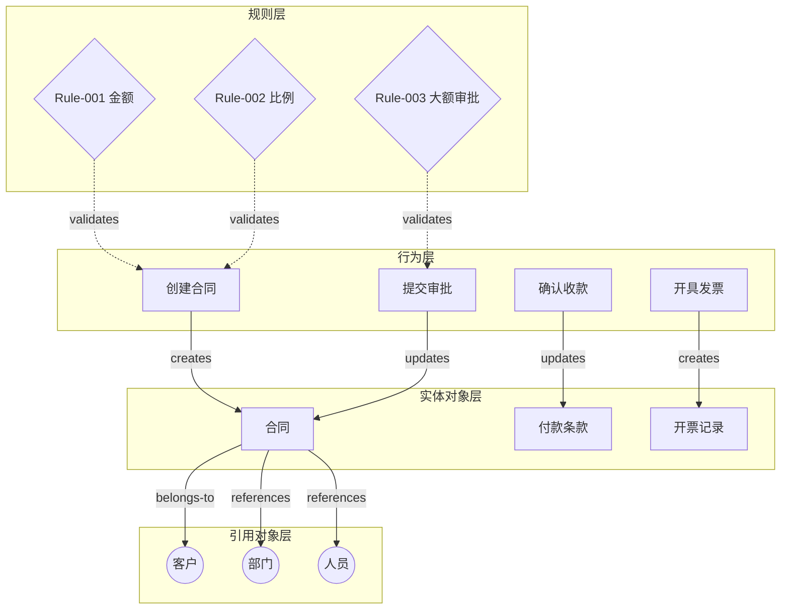
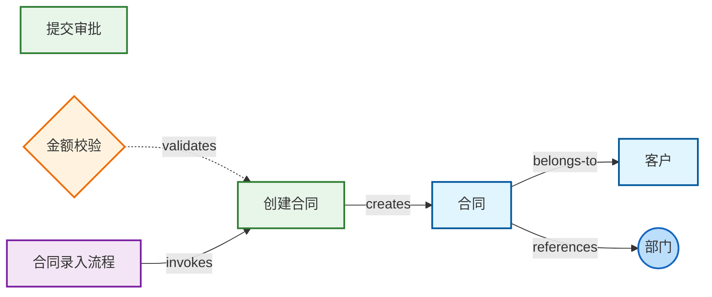
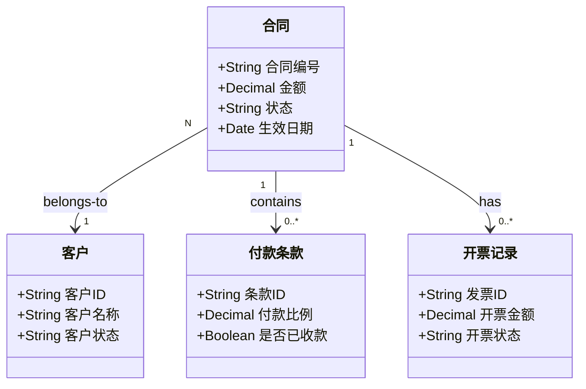
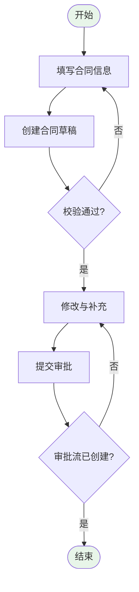

# 合同管理系统 领域模型

## 1. 领域概览

### 1.1 领域描述

合同管理系统覆盖业务合同从创建、审批、生效到收款、开票及作废的全生命周期，支撑销售承办、财务收款与主数据（客户、部门、人员）引用。

### 1.2 六类要素总览

与 `contract-management.json` 根级数组统计一致；主体、领域事件、异常与补偿为独立层级。

| 层级 | 核心内容 | 要素数量 |
|-----|---------|---------|
| 对象模型 | 数据实体及其关系 | 6 个实体 |
| 行为模型 | 对象操作与事件发布/消费 | 8 个行为 |
| 规则模型 | 业务规则与约束 | 6 条规则 |
| 主体模型 | 角色/系统/组织等 | 1 个主体 |
| 领域事件 | 行为 → 事件 → 行为/规则 | 1 个事件 |
| 异常与补偿 | 长流程失败与冲正/逆序 | 1 项补偿 |
| 场景/流程 | 业务编排与步骤（`processes`） | 3 个流程 |

### 1.3 核心实体列表

| 实体名称 | 类型 | 定义 |
|---------|------|------|
| 合同 | 核心 | 业务合同主数据，含金额、状态、客户与条款 |
| 客户 | 核心 | 签约客户 |
| 付款条款 | 核心 | 分期比例与收款状态 |
| 开票记录 | 核心 | 发票开具与状态 |
| 部门 | 引用 | 组织主数据 |
| 人员 | 引用 | 员工主数据 |

---

## 2. 对象模型

### 2.1 实体定义（摘要）

#### 合同（Entity-001）

**实体类型**：核心实体  

**定义**：记录合同编号、金额、状态、生效日期，关联客户、付款条款、开票、部门与承办人。

**属性列表**：

| 属性名称 | 数据类型 | 约束 | 描述 |
|---------|---------|------|------|
| 合同编号 | String | 必填、唯一、^CT[0-9]{10}$ | 合同唯一编号 |
| 金额 | Decimal | 必填、>=0 | 合同总金额（含税） |
| 状态 | String | 枚举 | 草稿/待审批/已生效/已作废/已完结 |
| 生效日期 | Date | 可选 | 生效日 |

**关联关系**：

- belongs-to → 客户（N:1）
- contains → 付款条款（1:N）
- has → 开票记录（1:N）
- managed-by → 部门、人员（N:1）

### 2.2 实体关系矩阵

| 实体A | 关系 | 实体B | 基数 | 描述 |
|------|------|------|------|------|
| 合同 | belongs-to | 客户 | N:1 | 签约客户 |
| 合同 | contains | 付款条款 | 1:N | 分期条款 |
| 合同 | has | 开票记录 | 1:N | 开票 |
| 人员 | belongs-to | 部门 | N:1 | 组织归属 |

---

## 3. 行为模型

### 3.1 行为定义（摘要）

| 行为 ID | 名称 | 所属实体 | 说明 |
|---------|------|---------|------|
| Behavior-001 | 创建合同 | 合同 | 新建草稿、生成编号 |
| Behavior-002 | 更新合同 | 合同 | 草稿/待审批下修改 |
| Behavior-003 | 作废合同 | 合同 | 作废及原因 |
| Behavior-004 | 提交审批 | 合同 | 进入审批流 |
| Behavior-005 | 确认收款 | 付款条款 | 标记某期已收款 |
| Behavior-006 | 开具发票 | 开票记录 | 创建发票记录 |
| Behavior-007 | 校验客户 | 客户 | 创建合同时校验客户 |
| Behavior-008 | 审批通过回调 | 合同 | 外部审批结果回写 |

### 3.2 行为关联矩阵

| 行为 | 调用行为 | 触发规则 | 所属流程 |
|------|---------|---------|---------|
| 创建合同 | 校验客户 | Rule-001, Rule-002 | 合同录入与提交 |
| 提交审批 | - | Rule-001~003 | 合同录入与提交 |

---

## 4. 规则模型

### 4.1 规则定义（摘要）

| 规则 ID | 名称 | 类型 | 优先级 |
|---------|------|------|--------|
| Rule-001 | 合同金额非空且大于零 | 校验 | 900 |
| Rule-002 | 付款条款比例之和为100% | 校验 | 850 |
| Rule-003 | 大额合同必须审批 | 业务 | 700 |
| Rule-004 | 合同状态转换合法 | 状态 | 800 |
| Rule-005 | 累计开票不超过合同金额 | 校验 | 750 |
| Rule-006 | 作废前检查未结清发票 | 业务 | 720 |

### 4.2 规则依赖

- Rule-003 依赖 Rule-001、Rule-002（提交审批前金额与条款已合法）

---

## 5. 流程模型

### 5.1 流程列表

| 流程 ID | 名称 | 触发 |
|---------|------|------|
| Process-001 | 合同录入与提交 | 用户新建合同 |
| Process-002 | 收款与开票 | 合同已生效 |
| Process-003 | 合同作废 | 用户申请作废 |

### 5.2 合同录入与提交（步骤摘要）

| 步骤 | 活动 | 类型 | 调用行为 | 触发规则 |
|-----|------|------|---------|---------|
| Step-001 | 填写合同信息 | 用户任务 | - | - |
| Step-002 | 创建合同草稿 | 服务任务 | Behavior-001 | Rule-001, Rule-002 |
| Step-003 | 修改与补充 | 用户任务 | Behavior-002 | Rule-001, Rule-002 |
| Step-004 | 提交审批 | 服务任务 | Behavior-004 | Rule-003 |

---

## 6. 可视化图

### 6.1 分层架构图

### 6.2 全景知识图谱（节选）

### 6.3 对象模型图

### 6.4 合同录入流程（flowchart）

---

## 7. 附录

### 7.1 术语表

| 术语 | 解释 |
|-----|------|
| 付款条款 | 分期付款的比例与计划，比例合计须为 100% |
| 引用实体 | 来自 HR/主数据的部门、人员，本系统不维护主数据明细 |

### 7.2 机器可读文件

与本模型一致的 JSON：与本文档**同基名**的 `.json` 文件（同目录；本示例为 `contract-management.json`）。

### 7.3 ID 映射表（节选）

| Markdown 名称 | JSON ID |
|----------------|---------|
| 合同 | Entity-001 |
| 创建合同 | Behavior-001 |
| 金额校验 | Rule-001 |
| 合同录入与提交 | Process-001 |

---

## 8. 变更记录

| 版本 | 日期 | 变更内容 | 作者 |
|-----|------|---------|------|
| 1.0 | 2026-03-23 | 初始版本 | ontology |
