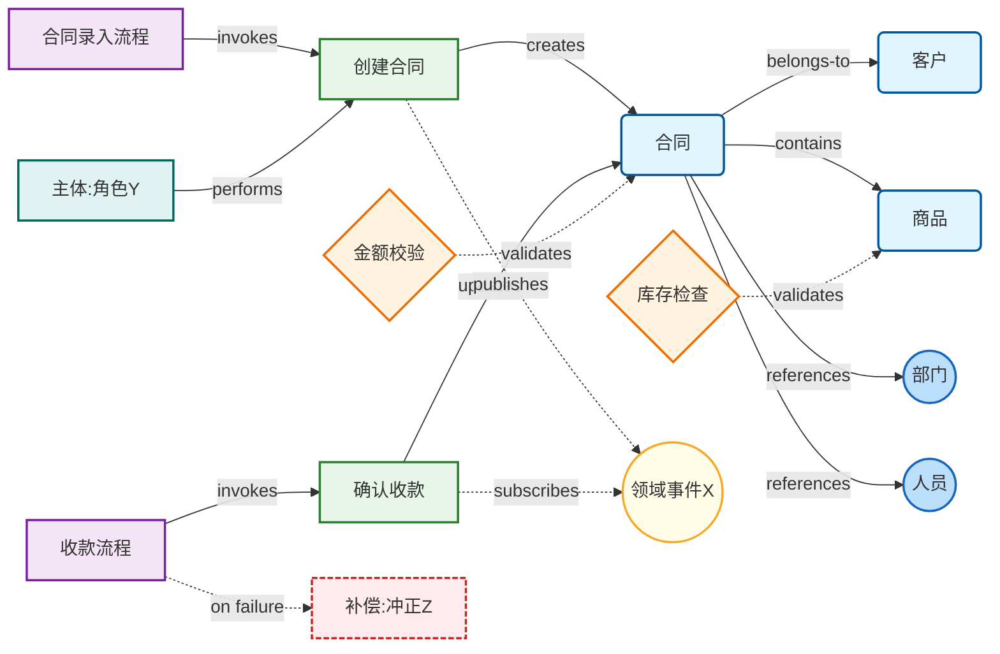
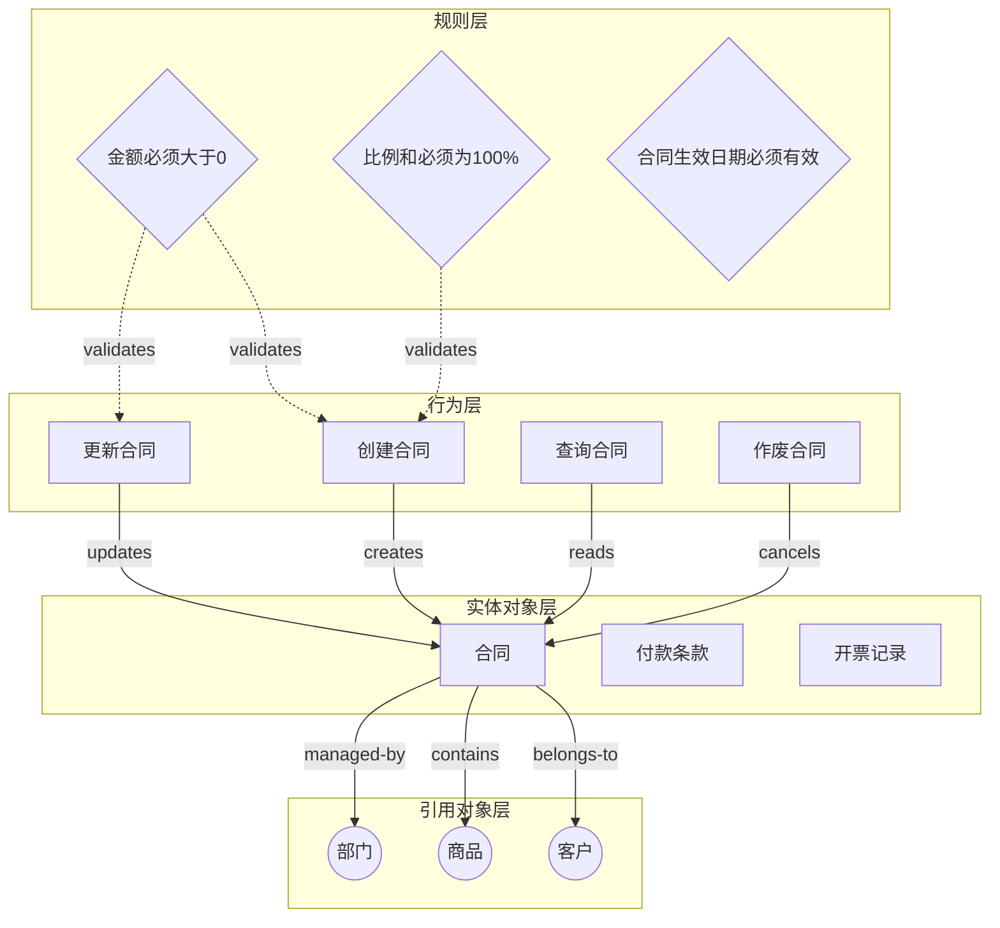
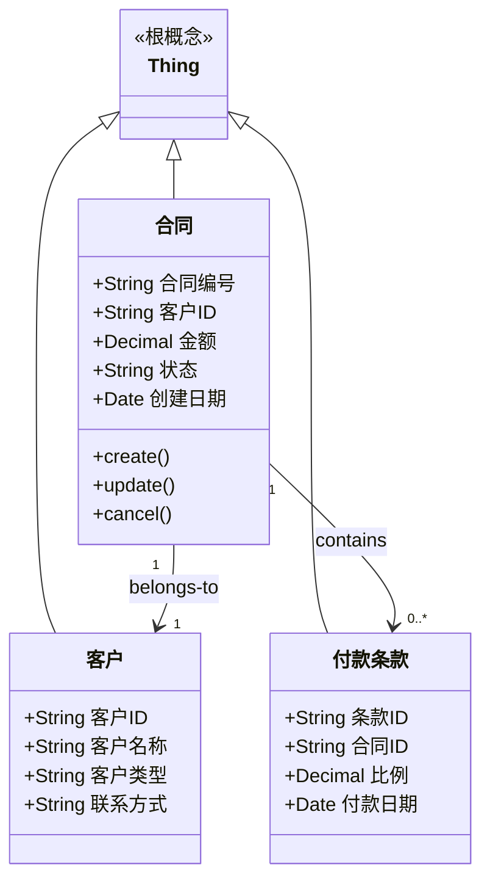
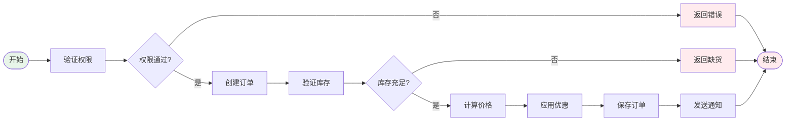
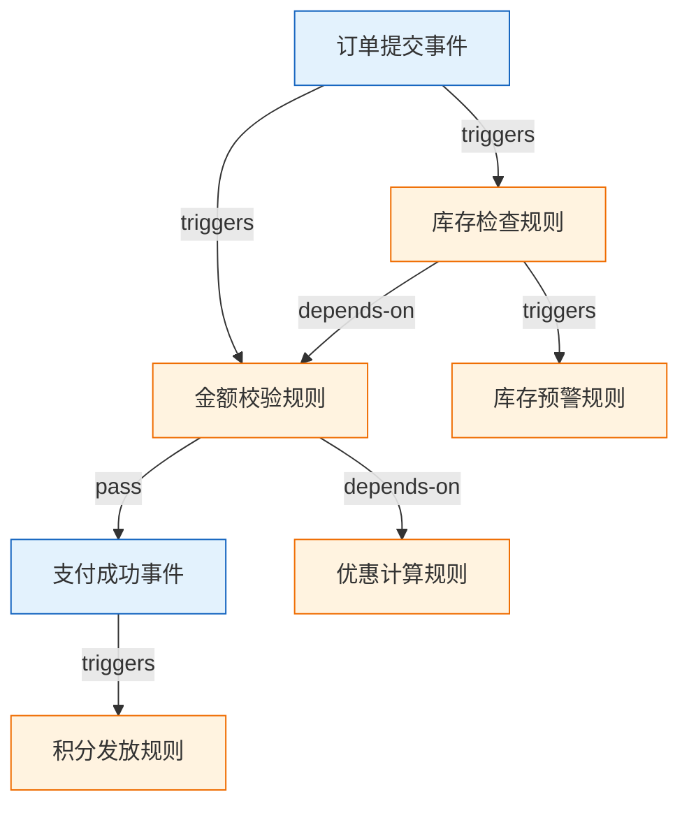
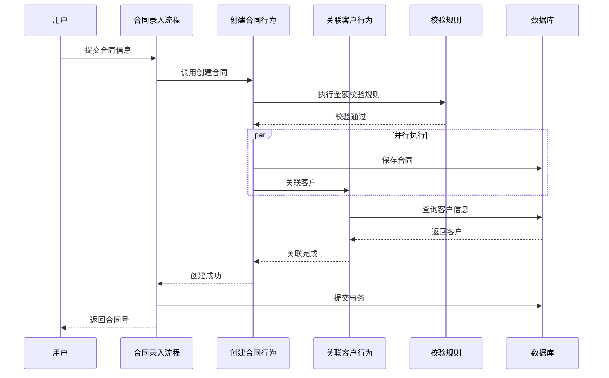

# 领域模型输出格式规范

## 目录
- [六类要素文档结构](#六类要素文档结构)
- [Mermaid可视化语法指南](#mermaid可视化语法指南)
- [可视化风格指南](#可视化风格指南)
- [JSON 交付物与详述来源](#json-交付物与详述来源)
- [格式验证规则](#格式验证规则)

## 六类要素文档结构

与 [SKILL.md](../SKILL.md) 术语及根字段一致：对象、行为、规则、**场景/流程**、**主体**、**领域事件**、**异常与补偿**在文档中的分布见下模板；与 EDA/主体/补偿的衔接见 [eda-subject-compensation.md](eda-subject-compensation.md)。完整章节约束见 [domain-model-template.md](../assets/domain-model-template.md)。

### 文档结构模板

```markdown
# <领域名称> 领域模型

## 1. 领域概览

### 1.1 领域描述
简要描述领域的业务范围、背景和目标。

### 1.2 模型总览（含场景/流程、主体、事件、补偿）
| 层级 | 核心内容 | 要素数量 |
|-----|---------|---------|
| 对象模型 | 数据实体及其关系 | N个实体 |
| 行为模型 | 对象操作与事件发布/消费 | N个行为 |
| 规则模型 | 业务规则与约束 | N条规则 |
| 主体模型 | 角色/系统/组织等 | N个主体 |
| 领域事件 | 行为→事件→行为/规则 | N个事件 |
| 异常与补偿 | 失败与 Saga/冲正 | N项补偿 |
| 场景/流程 | 业务场景与编排（JSON: processes） | N个流程 |

### 1.3 核心实体列表
| 实体名称 | 类型 | 定义 |
|---------|------|------|
| 实体1 | 核心/引用 | 定义描述 |
| 实体2 | 核心/引用 | 定义描述 |

## 2. 对象模型

### 2.1 实体定义

#### 2.1.1 <实体名称>
**实体类型**：核心实体 / 引用实体

**父类**：<直接父类（如有）>

**定义**：<实体的详细定义>

**属性列表**：

| 属性名称 | 数据类型 | 约束 | 描述 |
|---------|---------|------|------|
| 属性1 | 类型 | 约束条件 | 描述 |
| 属性2 | 类型 | 约束条件 | 描述 |

**关联关系**：
- 关系名称 → 关联实体（基数）

### 2.2 实体关系矩阵

| 实体A | 关系 | 实体B | 基数 | 描述 |
|------|------|------|------|------|
| 实体1 | has | 实体2 | 1:N | 描述 |

## 3. 行为模型

### 3.1 行为定义

#### 3.1.1 <行为名称>
**所属实体**：<该行为所属的数据实体>

**定义**：<行为的业务描述>

**输入参数**：

| 参数名称 | 数据类型 | 约束 | 描述 |
|---------|---------|------|------|
| 参数1 | 类型 | 约束条件 | 描述 |

**输出结果**：

| 结果类型 | 数据类型 | 描述 |
|---------|---------|------|
| 成功 | 类型 | 描述 |
| 失败 | 异常类型 | 描述 |

**前置条件**：
- 条件1
- 条件2

**后置条件**：
- 条件1
- 条件2

**调用关系**：
- invokes → 被调用的行为
- triggered-by → 触发该行为的行为

### 3.2 行为关联矩阵

| 行为 | 调用行为 | 触发规则 | 所属流程 |
|------|---------|---------|---------|
| 行为1 | 行为2, 行为3 | 规则1 | 流程A |

## 4. 规则模型

### 4.1 规则定义

#### 4.1.1 <规则名称>
**规则ID**：<唯一标识>

**类型**：校验规则 / 业务规则 / 状态规则 / 计算规则

**描述**：<规则的业务描述>

**触发条件**：
- 事件：<触发事件>
- 对象：<作用对象>
- 时机：<触发时机>

**规则条件**：
- 条件表达式：<布尔表达式>
- 条件说明：<自然语言说明>

**规则动作**：
条件为真时：
- 动作1
- 动作2

条件为假时：
- 动作1
- 动作2

**优先级**：<数值>

### 4.2 规则依赖矩阵

| 规则 | 触发事件 | 依赖规则 | 优先级 |
|------|---------|---------|--------|
| 规则1 | 事件A | 规则2 | 100 |

## 5. 流程模型

### 5.1 用例定义

#### 5.1.1 <用例名称>
**用例ID**：<唯一标识>

**参与者**：<主要参与者>, <次要参与者>

**前置条件**：
- 条件1

**后置条件**：
- 条件1

**基本流程**：
1. [参与者] [动作]
2. 系统 [响应]
3. ...

**扩展流程**：
3a. [分支条件]:
    3a.1 [处理步骤]

### 5.2 业务流程

#### 5.2.1 <流程名称>
**触发条件**：<触发条件>

**参与者**：<参与者列表>

**流程步骤**：

| 步骤 | 活动 | 类型 | 调用行为 | 触发规则 | 参与者 |
|-----|------|------|---------|---------|--------|
| 1 | 活动1 | 用户任务 | 行为1 | 规则1 | 用户 |
| 2 | 活动2 | 自动任务 | 行为2 | - | 系统 |

**分支逻辑**：
- 条件A → 步骤X
- 条件B → 步骤Y

## 6. 可视化图

### 6.1 全景知识图谱
```mermaid
graph LR
    %% 六类要素关系图：实体/行为/规则/流程 + 事件/主体/补偿
```

### 6.2 分层架构图
```mermaid
flowchart TD
    %% 规则层-行为层-实体层-引用层的分层结构
```

### 6.3 对象模型图
```mermaid
classDiagram
    %% 实体层次结构和属性
```

### 6.4 行为调用图
```mermaid
flowchart LR
    %% 行为调用关系和编排
```

### 6.5 规则依赖图
```mermaid
graph TD
    %% 规则触发和依赖关系
```

### 6.6 业务流程图
```mermaid
flowchart TD
    %% 业务流程步骤和分支
```

## 7. 附录

### 7.1 术语表
| 术语 | 解释 |
|-----|------|
| 术语1 | 解释1 |

### 7.2 变更记录
| 版本 | 日期 | 变更内容 | 作者 |
|-----|------|---------|------|
| 1.0 | 日期 | 初始版本 | 作者 |
```

## Mermaid可视化语法指南

### 1. 全景知识图谱（graph）

用于展示六类要素的完整关系网络；布局可采用**力导向**风格，如下简例。



**语法说明**：
- `classDef`：定义节点样式类
- `fill`：填充颜色
- `stroke`：边框颜色
- `stroke-width`：边框宽度
- `rx/ry`：圆角半径（椭圆用50px）
- `[节点名]`：方框节点
- `{节点名}`：菱形节点
- `((节点名))`：椭圆/圆形节点
- `-->`：实线连接
- `-.->`：虚线连接
- `|标签|`：关系标签

### 2. 分层架构图（flowchart）

用于展示从规则层到引用层的垂直分层结构，如下简例。



**语法说明**：
- `subgraph`：定义子图/分层
- `TB`：从上到下（Top to Bottom）
- 层间用虚线/实线连接表示不同类型的关系

### 3. 类图（classDiagram）

用于展示对象模型的实体层次结构和属性。



**语法说明**：
- `+`：public属性/方法
- `--|>`：继承关系
- `"1" --> "0..*"`：带基数的关联
- `: label`：关系标签

### 4. 行为调用图（flowchart）

用于展示行为的调用关系和编排顺序。



**语法说明**：
- `LR`：从左到右（Left to Right）
- `{判断}`：菱形判断节点
- `|标签|`：条件分支标签
- `style`：设置节点样式

### 5. 规则依赖图（graph）

用于展示规则的触发和依赖关系。



### 6. 时序图（sequenceDiagram）

用于展示流程中的行为调用序列和交互。



**语法说明**：
- `participant`：定义参与者
- `->>`：实线箭头（调用）
- `-->>`：虚线箭头（返回）
- `par/end`：并行块
- `alt/else/end`：条件分支

## 可视化风格指南

### 颜色方案

推荐采用下表**语义配色**；若用户已有产品/界面的色板约束，在保持语义可识别的前提下可与之对齐。

| 要素类型 | 填充色 | 边框色 | 用途 |
|---------|--------|--------|------|
| 数据实体 | #e1f5fe (浅蓝) | #01579b (深蓝) | 核心业务对象 |
| 行为操作 | #e8f5e9 (浅绿) | #2e7d32 (深绿) | 业务行为/操作 |
| 业务规则 | #fff3e0 (浅橙) | #ef6c00 (深橙) | 校验规则/约束 |
| 业务流程 | #f3e5f5 (浅紫) | #7b1fa2 (深紫) | 流程/用例 |
| 外部引用 | #bbdefb (天蓝) | #1565c0 (蓝) | 外部实体/引用 |
| 开始/结束 | #e8f5e9 (浅绿) | #2e7d32 (深绿) | 流程起止点 |
| 异常/错误 | #ffebee (浅红) | #c62828 (深红) | 异常处理 |

### 节点形状

| 要素类型 | 形状 | Mermaid语法 | 示例 |
|---------|------|------------|------|
| 数据实体 | 圆角矩形 | `[名称]` + rx/ry | 合同、订单 |
| 行为操作 | 矩形 | `[名称]` | 创建合同、确认收款 |
| 业务规则 | 菱形 | `{名称}` | 金额校验、库存检查 |
| 业务流程 | 矩形 | `[名称]` | 合同录入流程 |
| 外部引用 | 椭圆 | `((名称))` | 客户、商品 |
| 判断/分支 | 菱形 | `{判断?}` | 金额>10000? |
| 开始/结束 | 圆角 | `([开始])` | 开始、结束 |

### 连接线样式

| 关系类型 | 线型 | 颜色 | Mermaid语法 |
|---------|------|------|------------|
| 数据关系 | 实线 | 蓝色 | `-->` |
| 行为调用 | 实线 | 绿色 | `-->` |
| 规则校验 | 虚线 | 橙色 | `-.->` |
| 流程触发 | 实线 | 紫色 | `-->` |
| 异常处理 | 虚线 | 红色 | `-.->` |
| 依赖关系 | 虚线 | 灰色 | `-.->` |

### 标签规范

关系标签应简洁明确：
- 数据关系：`has`、`belongs-to`、`contains`
- 行为关系：`invokes`、`triggers`、`creates`
- 规则关系：`validates`、`checks`、`enforces`
- 流程关系：`starts`、`calls`、`triggers`

## 格式验证规则

### Markdown文档验证
- [ ] 文档对 **对象、行为、规则、场景/流程、主体、领域事件、异常与补偿** 均有**独立章节**或**明确声明**「本领域为空/不适用」
- [ ] 每个实体都有明确的类型、属性、关系
- [ ] 每个行为都有输入、输出、前置/后置条件
- [ ] 每个规则都有触发条件、条件表达式、动作
- [ ] 每个流程（场景）都有步骤、调用行为、触发规则
- [ ] 主体/事件/补偿与 JSON 中 `id` 可互查，或与「空/不适用」声明一致
- [ ] 表格格式正确，列对齐
- [ ] Mermaid代码块使用正确的语法高亮标记

### Mermaid代码验证
- [ ] 使用正确的图表类型（classDiagram、graph、flowchart、sequenceDiagram）
- [ ] 所有节点都已定义并应用样式类
- [ ] 关系语法正确，标签清晰
- [ ] 颜色方案符合风格指南
- [ ] 无语法错误（可通过Mermaid编辑器验证）

### 一致性验证
- [ ] Markdown文档中的实体名称与可视化代码一致
- [ ] Markdown文档中的行为名称与可视化代码一致
- [ ] Markdown文档中的规则名称与可视化代码一致
- [ ] 主体/事件/补偿名称与 JSON 各数组中 `id`、`name` 一致（或已声明不适用）
- [ ] 层间引用关系清晰准确
- [ ] JSON中的ID与Markdown文档中的名称一一对应
- [ ] JSON中的引用关系使用ID而非名称
- [ ] JSON 结构以 [machine-readable-format.md](machine-readable-format.md) 根结构为准，可通过校验脚本与/或 JSON Schema

## JSON 交付物与详述来源

- **文件**：`{basename}.md` 与 `{basename}.json`（**同基名**；`basename` 须从用户任务与源材料抽取，**不得**默认固化为 `domain-model`，见 [SKILL.md](../SKILL.md)「输出文件命名」）。可选 `{basename}.yaml`（与 JSON 同构，见 [eda-subject-compensation.md](eda-subject-compensation.md)）。
- **根级结构**：须包含 `domain`，`metadata`，`entities`，`behaviors`，`rules`，`subjects`，`events`，`compensations`，`processes`（各数组**可为** `[]`）；可选 `statistics`。

**根字段的 JSON Schema 片段、各对象字段、完整示例、ID 约定、集成与运行时关注点、机器消费指南与引用校验思路**均以 **[machine-readable-format.md](machine-readable-format.md)** 为**唯一**详述；本文件不重复，避免与 `machine-readable` 漂移。

### Markdown ↔ JSON 映射（人读侧摘要）

| 人读（文档/表） | JSON | 一致性要求 |
|----------------|------|-----------|
| 实体名 | `entities[].name` 与 `entities[].id` | 与文内表及图中名称一致，ID 见映射表/附录 |
| 行为名 | `behaviors[].name` / `id` | 同上 |
| 规则名 | `rules[].name` / `id` | 同上 |
| 流程/场景名 | `processes[].name` / `id` | 同上；与 `scene` 等别名说明不冲突 |
| 主体/事件/补偿 | `subjects` / `events` / `compensations` 的 `name` 与 `id` | 须与第 1 节总览或专章可互查 |
| 对象关系叙述 | `relations[].targetId` 等 | 关系落 **ID**；对象级完整示例见 `machine-readable`「Entity 示例」 |

