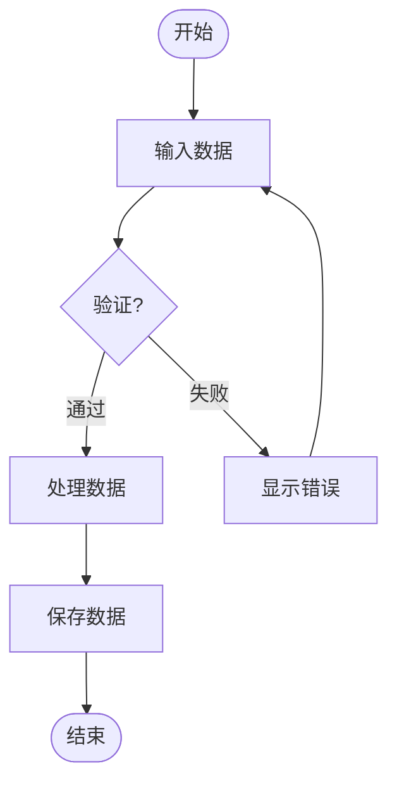
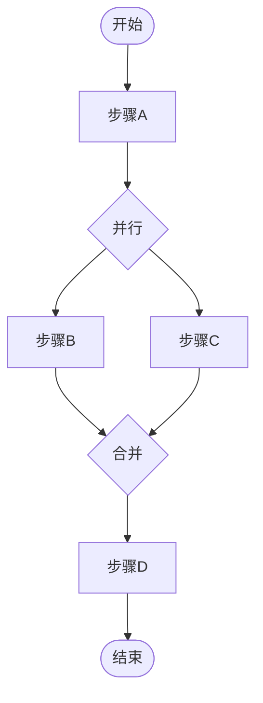
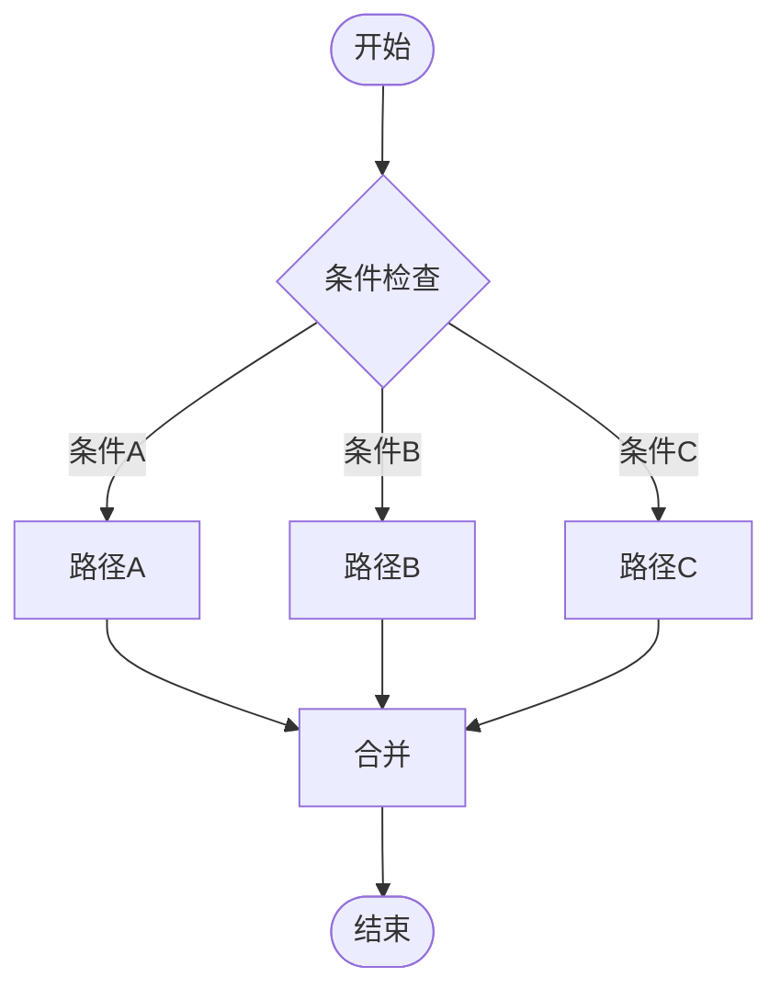
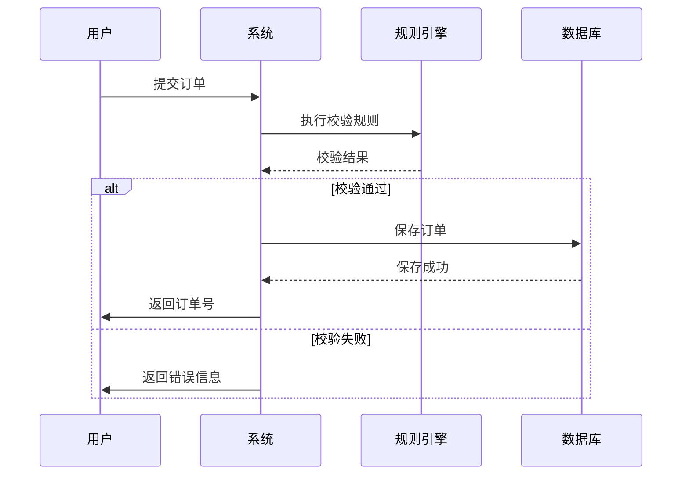

# 流程建模方法论

本文中的**流程**与技能中的**业务场景**一致，对应机器可读 JSON 根字段 `processes`。若需用**事件链**替代或配合长流程编排，见 [eda-subject-compensation.md](eda-subject-compensation.md)（行为→领域事件→行为/规则）与 [machine-readable-format.md](machine-readable-format.md) 中 `events`、`compensations`。

## 目录
- [流程建模概述](#流程建模概述)
- [用例建模](#用例建模)
- [业务流程建模](#业务流程建模)
- [行为编排](#行为编排)
- [BPMN规范](#bpmn规范)

## 流程建模概述

### 流程的定义
流程是为了完成特定业务目标而定义的一系列有序步骤，描述了"谁在什么场景下做什么"以及"如何做"。

### 流程的核心要素

1. **流程名称**
   - 定义：流程的唯一标识
   - 规范：动词+名词+流程，如"合同录入流程"、"订单支付流程"

2. **参与者（Actor）**
   - 定义：执行流程或参与流程的角色/系统
   - 类型：用户角色、系统、外部服务
   - 示例："销售人员"、"审批系统"、"支付网关"

3. **触发条件**
   - 定义：启动流程的条件或事件
   - 类型：事件触发、时间触发、手动触发
   - 示例："客户提交订单"、"每天凌晨2点"、"管理员手动启动"

4. **流程步骤**
   - 定义：流程中的具体活动
   - 类型：人工任务、自动任务、决策点、子流程

5. **流转路径**
   - 定义：步骤之间的流转关系
   - 类型：顺序、分支、并行、循环

6. **结束条件**
   - 定义：流程结束的状态
   - 类型：成功结束、异常结束、取消

## 用例建模

### 用例的定义
用例是对系统功能的描述，从用户视角描述"系统能做什么"。

### 用例图元素

#### 1. 参与者（Actor）
- **表示**：小人图标
- **定义**：与系统交互的外部角色
- **分类**：
  - 主要参与者：直接使用系统的用户
  - 次要参与者：支持系统的角色
  - 外部系统：与系统交互的其他系统

#### 2. 用例（Use Case）
- **表示**：椭圆
- **定义**：系统提供的功能单元
- **命名**：动词+名词，如"创建订单"、"查询库存"

#### 3. 关系
| 关系类型 | 表示 | 说明 | 示例 |
|---------|------|------|------|
| **关联** | 实线 | 参与者与用例的关系 | 用户 -- 创建订单 |
| **包含** | 虚线+`<<include>>` | 必须包含的子用例 | 创建订单 --<<include>>-- 验证库存 |
| **扩展** | 虚线+`<<extend>>` | 可选扩展的用例 | 创建订单 --<<extend>>-- 应用优惠券 |
| **泛化** | 实线+空心三角 | 用例的继承关系 | 支付 --|> 在线支付 |

### 用例规约模板

```
用例名称: [用例名称]
用例ID: [唯一标识]
参与者: [主要参与者], [次要参与者]

前置条件:
- [执行用例前必须满足的条件]

后置条件:
- [用例执行后的系统状态]

基本流程:
1. [参与者] [动作]
2. 系统 [响应/处理]
3. [参与者] [动作]
4. ...

扩展流程:
3a. [分支条件]:
    3a.1 [处理步骤]
    3a.2 [处理步骤]

异常流程:
4a. [异常条件]:
    4a.1 [异常处理]
    4a.2 [异常处理]

业务规则:
- [相关规则ID或描述]

数据需求:
- [输入数据]
- [输出数据]
```

### 用例示例

```
用例名称: 合同录入
用例ID: UC-001
参与者: 销售人员(主要), 合同系统(次要)

前置条件:
- 销售人员已登录系统
- 客户信息已存在

后置条件:
- 合同状态为"待审批"或"已生效"
- 合同数据已持久化

基本流程:
1. 销售人员选择"创建合同"功能
2. 系统显示合同录入表单
3. 销售人员填写合同基本信息（合同编号、客户、金额等）
4. 销售人员添加合同商品明细
5. 销售人员设置付款条款
6. 销售人员提交合同
7. 系统执行校验规则（金额校验、客户校验等）
8. 系统保存合同数据
9. 系统生成合同编号
10. 系统发送审批通知
11. 系统显示"提交成功"提示

扩展流程:
7a. 校验失败:
    7a.1 系统显示错误信息
    7a.2 返回步骤3，销售人员修改后重新提交

异常流程:
6a. 网络异常:
    6a.1 系统提示"网络异常，请稍后重试"
    6a.2 流程终止，数据保留在草稿状态

业务规则:
- RULE-001: 合同金额非空校验
- RULE-002: 客户存在性校验
- RULE-003: 大额订单审批规则

数据需求:
- 输入: 合同信息、商品明细、付款条款
- 输出: 合同编号、合同状态
```

## 业务流程建模

### 流程步骤类型

#### 1. 任务（Task）
- **定义**：流程中的具体工作单元
- **分类**：
  - **用户任务**：需要人工执行
  - **服务任务**：系统自动执行
  - **脚本任务**：执行脚本
  - **接收任务**：等待外部消息

#### 2. 网关（Gateway）
- **定义**：控制流程分支和合并
- **类型**：
  - **排他网关（XOR）**：多选一
  - **并行网关（AND）**：全部执行
  - **包容网关（OR）**：选零个或多个
  - **事件网关**：基于事件选择

#### 3. 事件（Event）
- **定义**：流程中的发生点
- **分类**：
  - **开始事件**：流程起点
  - **结束事件**：流程终点
  - **中间事件**：流程中间的事件
  - **边界事件**：附加在任务上的事件

#### 4. 子流程（Sub-process）
- **定义**：嵌套的流程
- **用途**：封装复杂逻辑、提高复用性

### 流程模式

#### 顺序模式
```
[步骤1] → [步骤2] → [步骤3]
```

#### 分支模式（排他）
```
       → [条件A] → [步骤A]
[决策] 
       → [条件B] → [步骤B]
```

#### 并行模式
```
      → [步骤A] →
[分支]            [合并] → [后续]
      → [步骤B] →
```

#### 循环模式
```
[步骤] → [条件检查] 
          ↓ 否
      ← [继续循环]
          ↓ 是
      [结束]
```

## 行为编排

### 编排的定义
行为编排是将多个行为按特定顺序组合，形成完整的业务流程。

### 编排模式

#### 1. 顺序编排
```
行为A → 行为B → 行为C
```
- 前一个行为成功后执行下一个
- 任一行为失败则流程终止

#### 2. 条件编排
```
      → [条件A] → 行为A
行为X 
      → [条件B] → 行为B
```
- 根据条件选择执行路径
- 只能执行一个分支

#### 3. 并行编排
```
      → 行为A →
[并行]          [合并] → 行为C
      → 行为B →
```
- 多个行为同时执行
- 所有行为完成后才继续

#### 4. 补偿编排（Saga模式）
```
行为A → 行为B → 行为C
  ↓       ↓       ↓
补偿A   补偿B   补偿C
```
- 长事务拆分为多个本地事务
- 任一失败执行补偿操作

### 行为与规则的关联

#### 触发规则
```
[行为] → triggers → [规则]
示例：创建订单 → 触发库存检查规则
```

#### 依赖规则
```
[规则] → validates → [行为]
示例：金额校验规则 → 验证支付行为
```

#### 编排示例
```
合同录入流程编排:
1. 验证用户权限（行为：权限检查）
   - 触发规则：用户角色校验
2. 创建合同草稿（行为：创建合同）
   - 依赖规则：合同编号生成规则
3. 并行执行：
   3a. 关联客户信息（行为：关联客户）
   3b. 添加商品明细（行为：添加商品）
4. 校验数据完整性（行为：数据校验）
   - 触发规则：必填项校验、格式校验
5. 计算金额（行为：金额计算）
   - 触发规则：价格计算规则、折扣规则
6. 提交审批（行为：提交审批）
   - 触发规则：大额订单规则（条件分支）
   - 如果金额>=10000: 送经理审批
   - 如果金额<10000: 自动批准
7. 发送通知（行为：发送通知）
```

## BPMN规范

### BPMN元素速查

#### 事件符号
| 符号 | 名称 | 说明 |
|-----|------|------|
| ◯ | 开始事件 | 流程起点 |
| ◉ | 结束事件 | 流程终点 |
| ◯+ | 中间事件 | 流程中间事件 |

#### 任务符号
| 符号 | 名称 | 说明 |
|-----|------|------|
| ▭ | 用户任务 | 人工执行 |
| ▭+齿轮 | 服务任务 | 自动执行 |
| ▭+文档 | 接收任务 | 等待消息 |

#### 网关符号
| 符号 | 名称 | 说明 |
|-----|------|------|
| ◇ | 排他网关 | X，多选一 |
| + | 并行网关 | +，全部执行 |
| ◇+O | 包容网关 | O，选零或多 |

### Mermaid BPMN语法

#### 基础流程图


#### 带并行的流程图


#### 带条件的流程图


#### 时序图（展示行为调用序列）


## 流程建模最佳实践

### 1. 粒度控制
- **高层流程**：展示业务全貌，3-7个主要步骤
- **详细流程**：展示具体实现，每个步骤可展开

### 2. 命名规范
- 任务命名：动词+名词，如"创建订单"
- 网关命名：疑问句，如"金额是否超过限额？"
- 事件命名：状态+事件，如"订单已提交"

### 3. 完整性检查
- 每个流程都有开始和结束
- 每个分支都有合并
- 每个异常都有处理

### 4. 可追溯性
- 流程步骤可追溯到业务需求
- 流程可追溯到用例
- 流程可追溯到行为和规则
